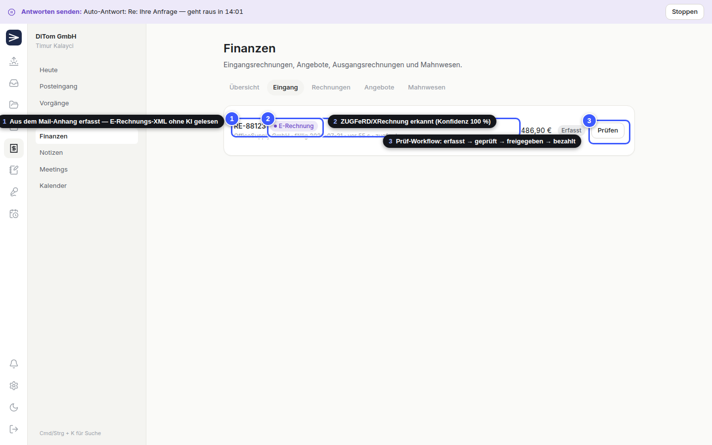
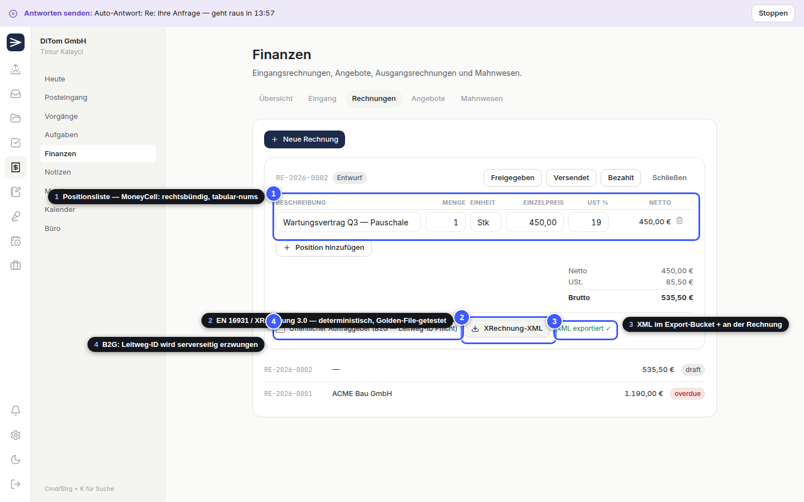
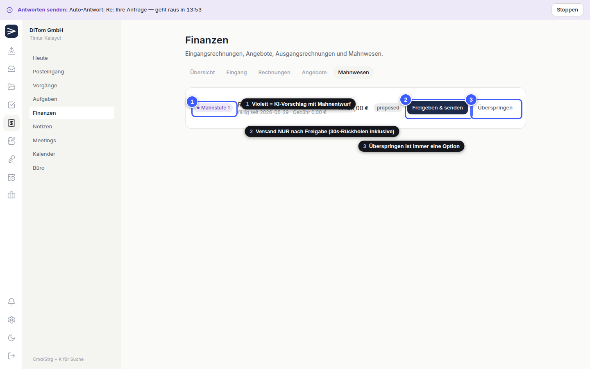
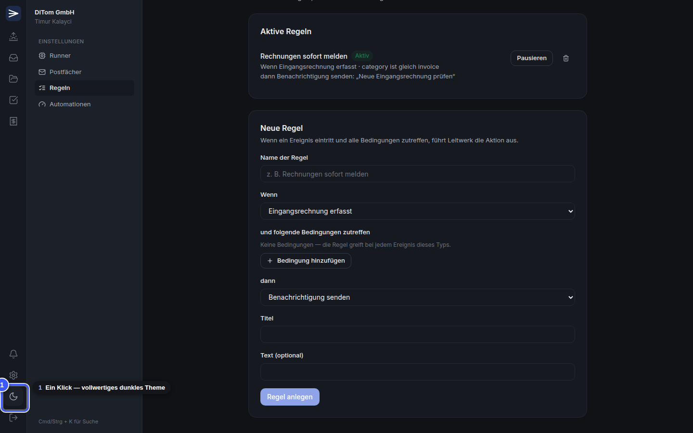

# Leitwerk

**Das Leitwerk für dein Büro.** Ein Multi-Tenant-Büro-Betriebssystem als PWA, dessen
KI-Arbeit ein **lokaler Agent-Runner** erledigt — jeder Nutzer bringt sein eigenes
Claude-Max-Abo mit (**BYO-KI**: kein zentraler API-Schlüssel, keine KI-Kosten beim Betreiber).

> E-Mails, Vorgänge, Aufgaben, Rechnungen, Termine, Notizen und Meetings in einer
> Oberfläche — verbunden durch einen KI-Kern, der sich sein Vertrauen messbar verdient
> (Autonomie-Regler Stufe 1–4 mit sichtbarer Trefferquote).


---

## Inhalt

- [Leitprinzipien](#leitprinzipien)
- [Architektur](#architektur)
- [Phase 0 im Detail — mit Screenshots](#phase-0-im-detail--mit-screenshots)
- [Roadmap](#roadmap)
- [Repo-Struktur](#repo-struktur)
- [Loslegen: lokale Test-Umgebung (ohne Supabase)](#loslegen-lokale-test-umgebung-ohne-supabase)
- [Loslegen: mit Supabase (Produktions-Setup)](#loslegen-mit-supabase-produktions-setup)
- [Dokumentation](#dokumentation)

---

## Leitprinzipien

1. **BYO-KI (Bring Your Own AI)** — Jeder Nutzer installiert den Runner auf seinem
   Rechner und loggt sich dort mit dem eigenen Claude-Account ein (`claude` CLI).
   Alternativ: Codex CLI oder eigener API-Key. Der Provider ist ein austauschbarer Adapter.
2. **Klebeschicht, kein Ersatz** — Gmail bleibt Gmail, der Kalender bleibt der Kalender.
   Leitwerk synchronisiert, verknüpft und denkt mit.
3. **Vorgänge statt Apps** — Die zentrale Einheit ist die Vorgangsakte: Mail, Datei,
   Termin, Rechnung, Notiz und Aufgabe hängen an einem Vorgang, zugeordnet durch KI.
4. **Proaktivität** — Nächtlicher Wächter-Lauf + Morgen-Briefing („Diese 5 Dinge
   brauchen dich heute“).
5. **Autonomie-Regler** — Jede Automatisierung startet auf Stufe 1 (nur Vorschlag) und
   wird erst nach messbar guter Trefferquote hochgestuft — bis Stufe 4 (autonom,
   meldet nur Ausnahmen).
6. **Human-in-the-loop by default** — Nichts verlässt das Haus ohne Freigabe, außer der
   Nutzer hat den Regler für genau diesen Prozess bewusst hochgeschoben.
7. **DSGVO-freundlich** — Daten in der EU (Supabase Frankfurt), KI über das Konto des
   Nutzers, Token-Tresor, vollständiges Audit-Log, RLS auf jeder Tabelle.

## Architektur

```
┌──────────────────────────────────────────────────────────────┐
│ PWA  (React 18 + Vite + TS strict, Tailwind, TanStack Query) │
│  Module: Heute · Posteingang · Vorgänge · Aufgaben · Finanzen│
└───────────────┬──────────────────────────────────────────────┘
                │ supabase-js (Auth, Realtime, Storage, RPC)
┌───────────────▼──────────────────────────────────────────────┐
│ Supabase (Postgres 15 + pgvector, RLS überall)               │
│  Edge Functions: runner-broker · build-job-context ·         │
│  oauth-gmail · mail-webhook · send-mail · export-xrechnung   │
└───────────────▲──────────────────────────────────────────────┘
                │ HTTPS (Runner-Token, nur Hash in der DB)
┌───────────────┴──────────────────────────────────────────────┐
│ leitwerk-runner (Node 20, pro Nutzer, lokal)                 │
│  Poll-Loop → claim_next_job → AiProvider → striktes Parsen   │
│  Provider: claude_cli (Max-Abo) · codex_cli · anthropic_api  │
└──────────────────────────────────────────────────────────────┘
```

Eckpfeiler: Der Runner schreibt **nie** direkt in die Datenbank — ausschließlich über
die RPCs `claim_next_job` / `job_heartbeat` / `complete_job` / `fail_job` hinter der
Edge Function `runner-broker` (Token-Hash-Verifikation). Prompts werden serverseitig
zusammengebaut (`build-job-context`), der Runner ist bewusst „dumm“. Jeder Job ist
idempotent (`result_hash`), jede KI-Aktion landet im Audit-Log.

---

## Phase 0 im Detail — mit Screenshots

Alle Bilder stammen aus einem automatisierten Ende-zu-Ende-Testlauf gegen die
[lokale Mock-Umgebung](#loslegen-lokale-test-umgebung-ohne-supabase) — reproduzierbar
mit `node tools/e2e-tutorial/run.mjs`. Die ausführliche Fassung mit allen 36 Bildern:
**[docs/testing-tutorial/TUTORIAL.md](docs/testing-tutorial/TUTORIAL.md)**.

### Anmelden & Registrieren

E-Mail/Passwort-Auth über Supabase, Google-Login vorbereitet. Deutsche Fehlermeldungen,
klare Zustände — nach `docs/DESIGN.md` (Referenzklasse Linear/Superhuman: ruhig, präzise,
kein Admin-Template).


### Onboarding-Wizard (5 Schritte)

Nach der Registrierung führt der Wizard durch die Einrichtung. Die Org-Anlage
bootstrapped im Hintergrund alles Nötige: Der Ersteller wird Owner, Firmen-Stammdaten,
vier Nummernkreise und sieben Standard-Automationen (alle auf Stufe 1) entstehen
automatisch per Datenbank-Trigger.


Die Stammdaten fließen später in Angebote, Rechnungen (ZUGFeRD/XRechnung, Phase 3)
und Signaturen. Nummernkreise mit Vorschau der nächsten Nummer:


### Runner-Pairing — das Herzstück des BYO-KI-Modells

Der Nutzer startet den Runner auf seinem Rechner (`npx leitwerk-runner init`), der
Runner zeigt einen 8-stelligen Code, der Nutzer tippt ihn in die PWA. Beim nächsten
Poll löst der Runner den Code ein und erhält sein Token — der Klartext existiert genau
einmal in dieser Antwort, in der Datenbank liegt nur der Hash. Das Pairing ist gehärtet:
Rate-Limit pro IP (10/Minute), Fehlversuchszähler pro Code (5 → Code gesperrt).


**Zwei-Stufen-Pairing:** Der frisch gepairte Runner startet als `pending_approval` und
darf nichts claimen, bis ein Owner/Admin ihn in der PWA bestätigt — ein erratener
Pairing-Code allein reicht damit nicht mehr für Datenzugriff:


Nach der Freigabe erscheint der Runner mit Live-Status (grün = Heartbeat < 3 Minuten,
dieselbe Schwelle nutzt der serverseitige Watchdog):


### Runner-Einstellungen & Test-Job

Die Kommandozentrale für den KI-Agenten: verbundene Runner mit Heartbeat und
Provider-Badge, Pairing weiterer Runner, und der Test-Job, der die komplette Kette
prüft. Ist kein Runner online, zeigt ein dezentes Banner das an — der Rest der App
bleibt voll benutzbar.


**Abo-Schutz pro Runner:** Stunden- und Tageslimit plus optionales Nachtfenster für
Batch-Jobs — serverseitig erzwungen in `claim_next_job` (nicht nur UI). Interaktive
Jobs laufen immer, Nacht-Batch (z. B. Wächter-Lauf) nur im konfigurierten Fenster:


Der Test-Job legt einen `echo`-Job in die Queue (Priorität 2 = interaktiv). Der Runner
claimt ihn per `claim_next_job` (prioritätssortiert, SKIP LOCKED), holt sich den
serverseitig zugeschnittenen Kontext, ruft die KI und liefert das strikt Zod-geparste
Ergebnis mit Idempotenz-Hash ab:


Der Status läuft live durch (Wartet → Läuft → Erledigt), die Antwort trägt das violette
**KI-Badge** — die eiserne Design-Regel: Violett markiert überall in Leitwerk
ausschließlich, was von der Maschine kommt.


### E-Mail-Hub + Vorgangsakte (Etappe 1)

Gmail verbinden (OAuth, Refresh-Token im Vault) → der Runner synchronisiert (Initial
90 Tage, Delta alle 2 Minuten) → jede neue Mail wird klassifiziert (`classify_email`)
und automatisch einem Vorgang zugeordnet oder als neuer Vorgang angelegt
(`case_match`, Konfidenz-Gate serverseitig):


KI-Antwortentwürfe (`draft_reply`) landen violett markiert im Thread — gesendet wird
nie ohne Freigabe, und jedes Senden hat ein serverseitig erzwungenes
30-Sekunden-Rückhol-Fenster:


Die Vorgangsakte bündelt alles mit Timeline (violetter Punkt = KI-Eintrag),
Nummernkreis und Status-Workflow:


### Aufgaben-Compiler, Nacht-Wächter & Morgen-Briefing (Etappe 2)

`extract_commitments` übersetzt Mails in Aufgaben-Vorschläge (violett, mit
Feedback-Schleife), der Nacht-Wächter (`gap_scan`) findet Liegengebliebenes, und
`morning_briefing` startet den Tag mit den wichtigsten Punkten samt direkter Aktion.
Die Follow-up-Engine fasst automatisch nach, wenn Antworten ausbleiben; Web-Push
bringt Benachrichtigungen aufs Gerät:


### Finanzen: E-Rechnung, XRechnung-Export & Mahnwesen (Etappe 3)

Eingangsrechnungen erfasst der Runner direkt aus dem Mail-Anhang: liegt ein
E-Rechnungs-XML (ZUGFeRD/XRechnung) bei, wird es **deterministisch ohne KI** gelesen —
sonst extrahiert die KI aus PDF-Text bzw. Mailtext. Danach: Prüf-Workflow
(erfasst → geprüft → freigegeben → bezahlt) mit Dubletten-Erkennung:



Ausgangsrechnungen und Angebote mit Positionsliste (Summen rechnet die Datenbank,
Nummern kommen atomar aus `next_number()`) und **XRechnung-3.0-Export** (UBL 2.1,
EN 16931, Golden-File-getestet; B2G-Leitweg-ID serverseitig erzwungen):



Das Mahnwesen schlägt bei überfälligen Rechnungen bis zu drei Stufen mit KI-Entwurf
vor — versendet wird ausschließlich nach Freigabe, über denselben geplanten Versand
mit 30-Sekunden-Rückholen wie jede Mail:



### Regel-Engine light (Einstellungen → Regeln)

Wenn-Dann-Regeln pro Organisation: „Wenn *Ereignis* und *Bedingungen*, dann *Aktion*
(Benachrichtigung, Aufgabe, KI-Job)“. Die Auswertung läuft serverseitig
(`evaluate_org_rules`); ab Phase 1 schleusen alle Module ihre Ereignisse
(`mail_received`, `invoice_captured`, `quote_sent`, `payment_matched`, …) hindurch:


### App-Shell, CommandBar & Dark Mode

Icon-Rail (56 px) → Kontext-Sidebar → Hauptfläche, alle Module navigierbar mit ehrlichen
Phasen-Platzhaltern (kein Feature ohne Empty-State). CommandBar per Strg/Cmd+K — wird in
Phase 4 zur globalen Suche (Volltext + semantisch via pgvector):


Vollwertiges dunkles Theme mit einem Klick, alle Design-Tokens aus
[docs/DESIGN.md](docs/DESIGN.md):



---

## Roadmap

Aus [docs/MASTERPLAN.md](docs/MASTERPLAN.md) §8 — jede Phase endet mit etwas täglich
Nutzbarem. Fertige Prompts pro Phase: [docs/ROADMAP_PROMPTS.md](docs/ROADMAP_PROMPTS.md).

| Phase | Umfang | Status |
|---|---|---|
| **P0 — Fundament** | Monorepo, Migrationen, Auth + Orgs, Onboarding, Runner-Pairing, Echo-Job Ende-zu-Ende, CI | ✅ **fertig** |
| **P0.5 — Security-Härtung** | Zwei-Stufen-Pairing, Rate-Limits, Abo-Schutz (Limits + Nachtfenster), Regel-Engine light, `service install` | ✅ **fertig** |
| **P1 — E-Mail-Hub** | Gmail-OAuth + Sync, Inbox (lesen/schreiben/senden mit 30s-Rückholen), `classify_email` + `case_match` + `draft_reply` + `thread_summary`, Vorgangsakte v1 → ab hier Dogfooding | ✅ **fertig** |
| **P2 — Aufgaben & Briefing** | Aufgaben-Compiler (`extract_commitments`), Follow-up-Engine, Nacht-Wächter (`gap_scan`), Morgen-Briefing, Web-Push | ✅ **fertig** |
| **P3 — Finanzen** | Eingangsrechnungs-Erfassung + Prüf-Workflow, Angebote/Rechnungen inkl. **XRechnung-XML** (EN 16931), Mahnwesen, Nummernkreise | ✅ **fertig** |
| **P4 — Autonomie & Wissen** | Autonomie-Regler-UI mit Trefferquoten (TrustMeter), Stufe-3-Halte-Zone, Notizen, `knowledge_distill`, semantische Suche, Meetings (Whisper lokal) | geplant |
| **P5 — Team & Papierkram** | Geteilte Postfächer, Kommentare/@Zuweisungen, Fristenkalender, IMAP-Fallback, Kalender-Sync, Wochenreport | geplant |
| **P6 — Komplett-Büro** | Zeiterfassung + Abwesenheiten, Banking-Sync + Zahlungsabgleich, DATEV-Export, Anrufprotokolle, Vertragsregister mit Kündigungs-Wächter | geplant |
| **P7 — Produktisierung** | Onboarding-Polish, Landing Page, Preismodell („keine KI-Kosten beim Anbieter“), gehosteter Runner als Option, Pen-Test | offen |

Der Job-Typen-Katalog des Runners (14 Skills von `classify_email` bis `weekly_report`)
steht in [docs/MASTERPLAN.md](docs/MASTERPLAN.md) §5.

## Repo-Struktur

| Pfad | Inhalt |
|---|---|
| `apps/pwa` | React 18 + Vite + TS (strict) + Tailwind 4 + TanStack Query + Zustand, installierbar als PWA |
| `apps/runner` | `leitwerk-runner` — Node-20-CLI-Daemon (Pairing, Poll-Loop, Skills, Provider-Adapter) |
| `packages/shared` | Zod-Schemas, Job-/Broker-Typen, Konstanten, Geld-Utils (Cent-Integer, de-DE) |
| `packages/ui` | Design-System nach `docs/DESIGN.md` (Tokens Light/Dark, AiBadge, EmptyState, …) |
| `supabase/` | 20 Migrationen + Edge Functions (Deno): `runner-broker`, `build-job-context`, `oauth-gmail`, `mail-sync`, `send-mail`, `send-push`, `export-xrechnung` |
| `migrations/` | **Verbindliche Datenmodell-Wahrheit** — Code folgt dem Schema, nicht umgekehrt |
| `tools/mock-server` | Lokales Mock-Backend (ersetzt Supabase zum Testen) + Mock-Claude-CLI |
| `tools/e2e-tutorial` | Playwright-Lauf: komplette User-Journey + annotierte Screenshots |
| `docs/` | [MASTERPLAN](docs/MASTERPLAN.md) · [DESIGN](docs/DESIGN.md) · [ROADMAP_PROMPTS](docs/ROADMAP_PROMPTS.md) · [CHANGELOG](docs/CHANGELOG.md) · [Test-Tutorial](docs/testing-tutorial/TUTORIAL.md) |
| `tutorials/` | Manuelle Betreiber-Schritte: Supabase, Google OAuth, Functions, Deployment, Runner, Banking/DATEV |

## Loslegen: lokale Test-Umgebung (ohne Supabase)

Der schnellste Weg, alles laufen zu sehen — kein Docker, kein Supabase, keine Secrets:

```bash
pnpm install
pnpm --filter leitwerk-runner build

# apps/pwa/.env anlegen:
#   VITE_SUPABASE_URL=http://127.0.0.1:54321
#   VITE_SUPABASE_ANON_KEY=mock-anon-key

node tools/mock-server/server.mjs            # Terminal 1: Mock-Backend (Port 54321)
pnpm --filter @leitwerk/pwa dev              # Terminal 2: PWA → http://localhost:5173

# Terminal 3: Runner pairen (Code in der PWA eingeben) und starten
node apps/runner/dist/index.js init --url http://127.0.0.1:54321/functions/v1
LEITWERK_CLAUDE_BIN="node tools/mock-server/claude-mock.cjs" node apps/runner/dist/index.js start
```

Schritt-für-Schritt mit Screenshots: **[docs/testing-tutorial/TUTORIAL.md](docs/testing-tutorial/TUTORIAL.md)**.

## Loslegen: mit Supabase (Produktions-Setup)

Voraussetzungen: Node ≥ 20, pnpm ≥ 9, [Supabase CLI](https://supabase.com/docs/guides/local-development) + Docker.

```bash
pnpm install
supabase start                                        # führt alle 16 Migrationen aus
cp apps/pwa/.env.example apps/pwa/.env                # anon key aus supabase start eintragen
cp supabase/functions/.env.example supabase/functions/.env   # RUNNER_TOKEN_PEPPER setzen
supabase functions serve --env-file supabase/functions/.env  # eigenes Terminal
pnpm dev                                              # PWA → http://localhost:5173
```

Hosted-Deployment (Secrets, Functions, pg_cron, Typen-Generierung):
Deploy-Liste in [docs/CHANGELOG.md](docs/CHANGELOG.md), Details in [tutorials/](tutorials/).

Nützlich: `pnpm lint` · `pnpm test` · `pnpm build` · `node tools/e2e-tutorial/run.mjs` (Screenshots neu erzeugen)

## Dokumentation

- **[MASTERPLAN.md](docs/MASTERPLAN.md)** — Produktdefinition A–Z, BYO-KI-Modell, Datenmodell, Sicherheit/DSGVO, Risiken
- **[DESIGN.md](docs/DESIGN.md)** — Design-System: Tokens, Typografie, Kernkomponenten, verbotene Muster
- **[ROADMAP_PROMPTS.md](docs/ROADMAP_PROMPTS.md)** — fertige Claude-Code-Prompts für jede Phase
- **[CHANGELOG.md](docs/CHANGELOG.md)** — was in welcher Phase entstand + manuelle Deploy-Schritte
- **[Test-Tutorial](docs/testing-tutorial/TUTORIAL.md)** — jedes Feature mit annotiertem Screenshot
- **[tutorials/](tutorials/)** — manuelle Betreiber-Schritte (Supabase, OAuth, Deployment, Runner, Banking/DATEV)

---

**Tech-Stack:** React 18 · Vite 6 · TypeScript strict · Tailwind 4 · TanStack Query · Zustand ·
Supabase (Postgres 15 + pgvector, RLS, Edge Functions/Deno) · Node 20 · Zod · Vitest · Playwright ·
pnpm + Turborepo
