# Leitwerk

**Das Leitwerk für dein Büro.** Ein Multi-Tenant-Büro-Betriebssystem als PWA, dessen
KI-Arbeit ein **lokaler Agent-Runner** erledigt — jeder Nutzer bringt sein eigenes
Claude-Max-Abo mit (**BYO-KI**: kein zentraler API-Schlüssel, keine KI-Kosten beim Betreiber).

> E-Mails, Vorgänge, Aufgaben, Rechnungen, Termine, Notizen und Meetings in einer
> Oberfläche — verbunden durch einen KI-Kern, der sich sein Vertrauen messbar verdient
> (Autonomie-Regler Stufe 1–4 mit sichtbarer Trefferquote).


---

## Inhalt

- [Leitprinzipien](#leitprinzipien)
- [Architektur](#architektur)
- [Die komplette Funktions-Tour (alle 51 Screenshots)](#die-komplette-funktions-tour-alle-51-screenshots)
- [Roadmap](#roadmap)
- [Repo-Struktur](#repo-struktur)
- [Loslegen: lokale Test-Umgebung (ohne Supabase)](#loslegen-lokale-test-umgebung-ohne-supabase)
- [Loslegen: mit Supabase (Produktions-Setup)](#loslegen-mit-supabase-produktions-setup)
- [Dokumentation](#dokumentation)

---

## Leitprinzipien

1. **BYO-KI (Bring Your Own AI)** — Jeder Nutzer installiert den Runner auf seinem
   Rechner und loggt sich dort mit dem eigenen Claude-Account ein (`claude` CLI).
   Alternativ: Codex CLI oder eigener API-Key. Der Provider ist ein austauschbarer Adapter.
2. **Klebeschicht, kein Ersatz** — Gmail bleibt Gmail, der Kalender bleibt der Kalender.
   Leitwerk synchronisiert, verknüpft und denkt mit.
3. **Vorgänge statt Apps** — Die zentrale Einheit ist die Vorgangsakte: Mail, Datei,
   Termin, Rechnung, Notiz und Aufgabe hängen an einem Vorgang, zugeordnet durch KI.
4. **Proaktivität** — Nächtlicher Wächter-Lauf + Morgen-Briefing („Diese 5 Dinge
   brauchen dich heute“).
5. **Autonomie-Regler** — Jede Automatisierung startet auf Stufe 1 (nur Vorschlag) und
   wird erst nach messbar guter Trefferquote hochgestuft — bis Stufe 4 (autonom,
   meldet nur Ausnahmen).
6. **Human-in-the-loop by default** — Nichts verlässt das Haus ohne Freigabe, außer der
   Nutzer hat den Regler für genau diesen Prozess bewusst hochgeschoben.
7. **DSGVO-freundlich** — Daten in der EU (Supabase Frankfurt), KI über das Konto des
   Nutzers, Token-Tresor, vollständiges Audit-Log, RLS auf jeder Tabelle.

## Architektur

```
┌──────────────────────────────────────────────────────────────┐
│ PWA  (React 18 + Vite + TS strict, Tailwind, TanStack Query) │
│  Heute·Posteingang·Vorgänge·Aufgaben·Finanzen·Kalender·Büro │
└───────────────┬──────────────────────────────────────────────┘
                │ supabase-js (Auth, Realtime, Storage, RPC)
┌───────────────▼──────────────────────────────────────────────┐
│ Supabase (Postgres 15 + pgvector, RLS überall)               │
│  Edge Functions: runner-broker · build-job-context ·         │
│  oauth-gmail · mail-webhook · send-mail · export-xrechnung   │
└───────────────▲──────────────────────────────────────────────┘
                │ HTTPS (Runner-Token, nur Hash in der DB)
┌───────────────┴──────────────────────────────────────────────┐
│ leitwerk-runner (Node 20, pro Nutzer, lokal)                 │
│  Poll-Loop → claim_next_job → AiProvider → striktes Parsen   │
│  Provider: claude_cli (Max-Abo) · codex_cli · anthropic_api  │
└──────────────────────────────────────────────────────────────┘
```

Eckpfeiler: Der Runner schreibt **nie** direkt in die Datenbank — ausschließlich über
die RPCs `claim_next_job` / `job_heartbeat` / `complete_job` / `fail_job` hinter der
Edge Function `runner-broker` (Token-Hash-Verifikation). Prompts werden serverseitig
zusammengebaut (`build-job-context`), der Runner ist bewusst „dumm“. Jeder Job ist
idempotent (`result_hash`), jede KI-Aktion landet im Audit-Log.

---

## Die komplette Funktions-Tour (alle 51 Screenshots)

Jedes Bild stammt aus **einem einzigen automatisierten Ende-zu-Ende-Lauf**
(`node tools/e2e-tutorial/run.mjs`) gegen die
[lokale Mock-Umgebung](#loslegen-lokale-test-umgebung-ohne-supabase) — kein Docker, kein
Supabase, keine Secrets. Die Annotationen (nummerierte Marker) werden im selben Lauf
gerendert. Die Schritt-für-Schritt-Fassung mit denselben Bildern:
**[docs/testing-tutorial/TUTORIAL.md](docs/testing-tutorial/TUTORIAL.md)**.

> **Lesehilfe zur Farbe:** In ganz Leitwerk markiert **Violett** ausnahmslos, was von der
> **KI** stammt (Entwürfe, Vorschläge, Zusammenfassungen). Alles andere hat der Mensch
> ausgelöst. Diese Regel aus `docs/DESIGN.md` zieht sich durch jeden folgenden Screenshot.

---

### 1 · Anmeldung & Registrierung

Der Einstieg läuft über E-Mail/Passwort-Auth (Supabase Auth), Google-Login ist
vorbereitet. Fehlermeldungen sind deutsch, jede Eingabe hat einen klaren Zustand —
Referenzklasse Linear/Superhuman: ruhig, präzise, kein Admin-Template.


Die Registrierung legt nur das Nutzerkonto an — die Organisation entsteht im nächsten
Schritt. Passwortregeln und Validierung greifen sofort im Client, final prüft Supabase.


### 2 · Onboarding-Wizard (5 Schritte)

**Schritt 1 — Organisation.** Der Name der Firma ist alles, was hier nötig ist. Im
Hintergrund bootstrapped ein Datenbank-Trigger die komplette Org: Der Ersteller wird
`owner`, es entstehen Firmen-Stammdaten, vier Nummernkreise und sieben
Standard-Automationen — alle auf **Autonomie-Stufe 1** (nur Vorschlag). Multi-Tenancy
ist ab der ersten Sekunde aktiv (jede Zeile trägt `org_id`, RLS überall).


**Schritt 2 — Stammdaten.** Anschrift, Steuernummer/USt-IdNr., Bankverbindung. Diese
Daten fließen später unverändert in Angebote, Rechnungen (ZUGFeRD/XRechnung) und
Signaturen — einmal erfasst, überall korrekt.


**Schritt 3 — Postfach (optional).** Gmail lässt sich schon hier verbinden oder später.
Der Wizard blockiert nicht: Überspringen ist jederzeit möglich, Dogfooding beginnt auch
ohne Postfach.


**Schritt 4 — Runner-Pairing (Herzstück des BYO-KI-Modells).** Der Nutzer startet den
Runner auf seinem Rechner (`npx leitwerk-runner init`), dieser zeigt einen 8-stelligen
Code, der Nutzer tippt ihn in die PWA. Beim nächsten Poll löst der Runner den Code ein
und erhält sein Token — der **Klartext existiert genau einmal** in dieser Antwort, in der
Datenbank liegt nur der Hash. Gehärtet mit Rate-Limit pro IP (10/Minute) und
Fehlversuchszähler pro Code (5 → Code gesperrt).


**Zwei-Stufen-Pairing.** Der frisch gepairte Runner startet als `pending_approval` und
darf **nichts** claimen, bis ein Owner/Admin ihn in der PWA bestätigt. Ein erratener
Pairing-Code allein verschafft damit keinen Datenzugriff.


Nach der Freigabe erscheint der Runner mit **Live-Status**: grün bedeutet Heartbeat
jünger als 3 Minuten — dieselbe Schwelle nutzt der serverseitige Watchdog, der tote
Runner erkennt und Jobs zurückstellt.


**Schritt 5 — Nummernkreise.** Angebote, Auftragsbestätigungen, Rechnungen und
Gutschriften bekommen je einen Zähler mit Präfix und Vorschau der nächsten Nummer.
Vergeben werden sie atomar per `next_number()` — keine Lücken, keine Dubletten, auch bei
parallelen Zugriffen.


**Fertig.** Der Wizard fasst zusammen und übergibt in die App — ab hier ist die Org
voll arbeitsfähig.


### 3 · App-Shell & Grundgerüst

„Heute“ ist die Startfläche: Icon-Rail (56 px) → Kontext-Sidebar → Hauptfläche. Von hier
sind alle Module erreichbar (Posteingang, Vorgänge, Aufgaben, Finanzen, Notizen,
Meetings, Kalender, Büro). Kein Bereich ohne durchdachten Zustand — hier der ruhige
Start des Tages.


**Empty-States sind Feature, nicht Lückenfüller.** Solange keine Rechnungen existieren,
erklärt der leere Finanzbereich, was als Nächstes passiert, statt eine leere Tabelle zu
zeigen — Pflicht laut `docs/DESIGN.md` (jede Ansicht: Empty-, Loading-, Fehler-Zustand).

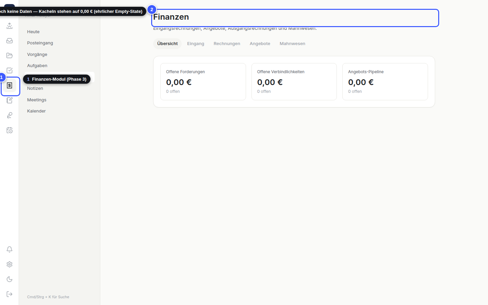

**CommandBar (Strg/Cmd + K).** Die globale Steuerzentrale: springt zu Modulen, öffnet
Aktionen und ist zugleich der Einstieg in die Suche. Tastatur-first, jederzeit
verfügbar.


### 4 · Runner-Steuerung & Test-Job

Die Kommandozentrale für den KI-Agenten: verbundene Runner mit Heartbeat und
Provider-Badge (`claude_cli` / `codex_cli` / `anthropic_api`), Pairing weiterer Runner.
Ist kein Runner online, weist ein dezentes Banner darauf hin — der Rest der App bleibt
voll benutzbar.


**Abo-Schutz pro Runner.** Stunden- und Tageslimit plus optionales **Nachtfenster** für
Batch-Jobs — serverseitig erzwungen in `claim_next_job`, nicht nur im UI. Interaktive
Jobs (Priorität ≤ 2) laufen immer; Nacht-Batch wie der Wächter-Lauf nur im
konfigurierten Zeitraum. So bleibt das mitgebrachte Claude-Abo im Rahmen.


**Test-Job.** Ein Klick legt einen `echo`-Job in die Queue (Priorität 2 = interaktiv).
Der Runner claimt ihn per `claim_next_job` (prioritätssortiert, `SKIP LOCKED`), holt den
serverseitig zugeschnittenen Kontext (`build-job-context`), ruft die KI und liefert das
strikt Zod-geparste Ergebnis mit Idempotenz-Hash ab.


Der Status läuft **live** durch (Wartet → Läuft → Erledigt, via Realtime), die Antwort
trägt das violette KI-Badge. Damit ist die komplette Kette bewiesen:
PWA → Queue → Runner → KI → Ergebnis zurück in der PWA.


### 5 · E-Mail-Hub + Vorgangsakte (Etappe 1)

**Postfach verbinden** per Google-OAuth — der Refresh-Token wandert sofort in den
Supabase Vault, nie in den Client oder ins Log.


Nach dem Consent zeigt die PWA das verbundene Konto samt Sync-Status. Der Runner holt
initial 90 Tage, danach Delta alle 2 Minuten.


**Inbox mit KI-Kategorien.** Jede neue Mail wird klassifiziert (`classify_email`) und
entweder einem bestehenden Vorgang zugeordnet oder als neuer angelegt (`case_match`,
Konfidenz-Gate serverseitig). Kategorien und Vorgangsbezug sind sofort sichtbar.


**Thread mit Auto-Vorgang.** Öffnet man einen Thread, hängt bereits ein Vorgang daran —
mit Nummernkreis. Rechts der Kontext, links die Nachrichten.


**KI-Antwortentwurf.** `draft_reply` schlägt eine Antwort im gelernten Schreibstil vor
(violett) — als Entwurf, nie automatisch gesendet.


**Senden mit 30-Sekunden-Rückholen.** Jeder Versand hat ein serverseitig erzwungenes
Undo-Fenster: In den ersten 30 Sekunden lässt sich die Mail zurückholen, bevor sie
tatsächlich rausgeht.


Danach erscheint die Nachricht als **gesendet** im Thread und in der Vorgangs-Timeline —
Outbound und Inbound an einem Ort.


### 6 · Aufgaben, Briefing & Benachrichtigungen (Etappe 2)

**Aufgaben-Compiler.** `extract_commitments` übersetzt Zusagen aus Mails in
Aufgaben-Vorschläge (violett, mit Feedback-Schleife: Annehmen/Verwerfen speist die
Trefferquote).


**Morgen-Briefing + Nacht-Wächter.** `morning_briefing` startet den Tag mit den
wichtigsten Punkten samt direkter Aktion; der nächtliche `gap_scan` findet
Liegengebliebenes (z. B. eine seit 3 Tagen unbeantwortete Mail) und meldet es als
Wächter-Finding.


**Notification-Center + Web-Push.** Benachrichtigungen sammeln sich zentral und kommen
per Web-Push aufs Gerät — auch wenn die PWA gerade nicht offen ist.


**Automationen mit TrustMeter.** Jede Automation zeigt ihre gemessene Trefferquote —
die Grundlage dafür, ob sie überhaupt hochgestuft werden darf.


### 7 · Vorgänge — die zentrale Einheit

Die Vorgangsliste bündelt alle Fälle mit Status, Nummernkreis und letzter Aktivität.
Vorgänge sind das Rückgrat: Mail, Datei, Termin, Rechnung, Notiz und Aufgabe hängen
daran.


Die **Vorgangsakte** zeigt die komplette Timeline (violetter Punkt = KI-Eintrag),
verknüpfte Objekte und den Status-Workflow — ein Fall, eine Akte, kein App-Springen.


### 8 · Finanzen: E-Rechnung, XRechnung & Mahnwesen (Etappe 3)

**Eingangsrechnungen** erfasst der Runner direkt aus dem Mail-Anhang: liegt ein
E-Rechnungs-XML (ZUGFeRD/XRechnung) bei, wird es **deterministisch ohne KI** gelesen —
sonst extrahiert die KI aus PDF- bzw. Mailtext. Danach der Prüf-Workflow
(erfasst → geprüft → freigegeben → bezahlt) mit Dubletten-Erkennung.


**Rechnungs-Editor.** Angebote und Ausgangsrechnungen mit Positionsliste — die Summen
rechnet die Datenbank, die Nummer kommt atomar aus `next_number()`. Der
**XRechnung-3.0-Export** (UBL 2.1, EN 16931) ist Golden-File-getestet; die B2G-Leitweg-ID
wird serverseitig erzwungen.


**Mahnwesen.** Bei überfälligen Rechnungen schlägt der Runner bis zu drei Stufen mit
KI-Entwurf vor — versendet wird ausschließlich nach Freigabe, über denselben geplanten
Versand mit 30-Sekunden-Rückholen wie jede Mail.


### 9 · Autonomie, Halte-Zone, Wissen & Meetings (Etappe 4)

**Autonomie-Regler (1–4) mit serverseitigem Gate.** Das Hochstufen auf Stufe 3/4 prüft
der Server (`set_autonomy_level`): erst ab nachgewiesener Trefferquote über genügend
Läufe — nicht nur im UI. Stufe 1 schlägt vor, Stufe 4 handelt autonom und meldet nur
Ausnahmen.

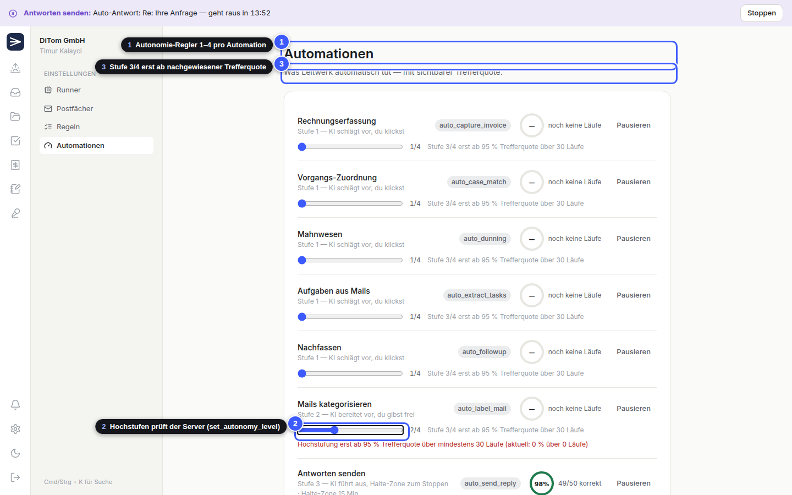

**Halte-Zone (Stufe 3).** Aktionen mit Außenwirkung laufen sichtbar durch eine Wartezone
mit Countdown — ein Klick stoppt sie vor dem Versand (`stop_automation_run`, Outcome
`corrected`). Der violette Banner in der App-Shell macht das jederzeit sichtbar.

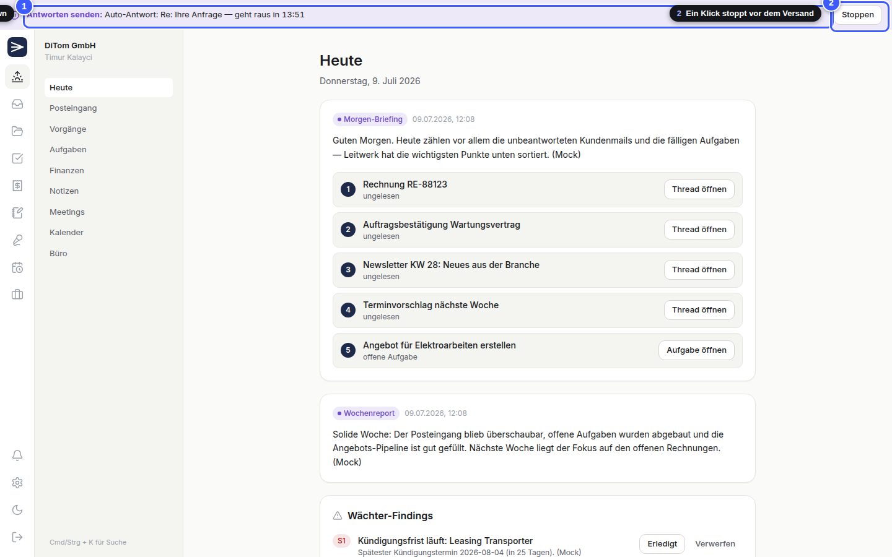

**Notizen & Sprachnotizen.** Markdown-Notizen mit Anlage/Bearbeiten/Löschen; Sprachnotiz
via MediaRecorder → Job `transcribe_note` → **Whisper transkribiert lokal** im Runner
(keine Cloud).

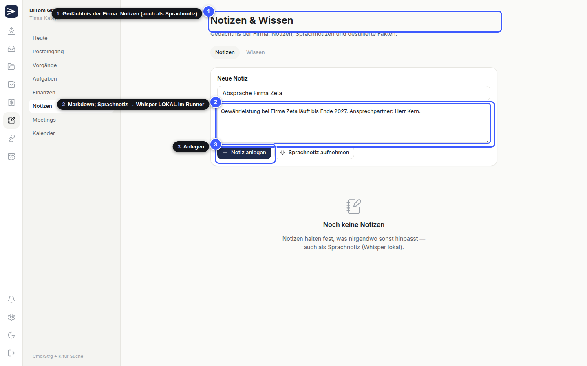

**Institutionelles Wissen.** `knowledge_distill` destilliert dauerhafte Firmenfakten aus
Mails und Meetings — jeder Vorschlag wird **geprüft** (Bestätigen/Ablehnen), bevor er ins
Gedächtnis wandert. So altert das Wissen nicht ungefiltert.

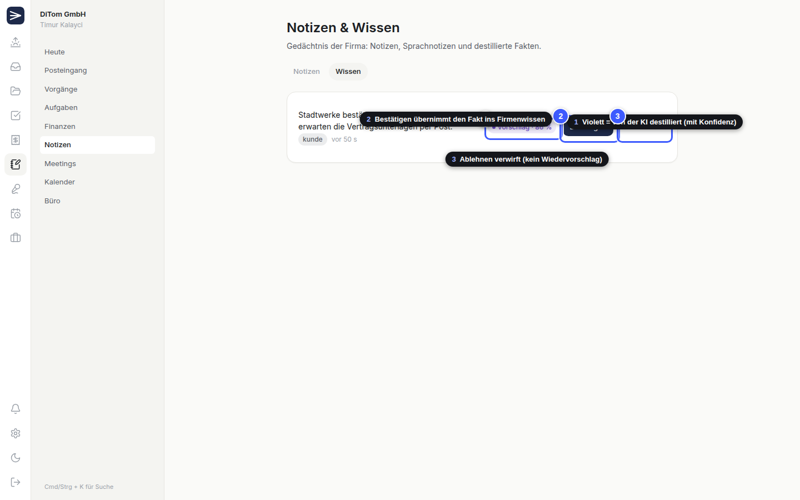

**Meetings.** Audio hochladen → `transcribe_meeting` (Whisper lokal) → Folgejob
`summarize_meeting` erzeugt ein KI-Protokoll mit Entscheidungen und Aufgaben, verknüpft
mit dem passenden Vorgang.

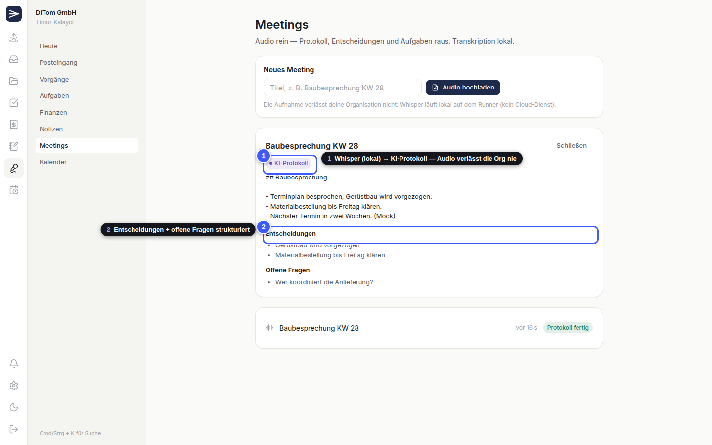

### 10 · Kombinierte Suche (Volltext + semantisch)

Die CommandBar-Suche liefert Volltext (`tsvector`) sofort und semantische Treffer
(`pgvector`) auf Knopfdruck. Das entscheidende Detail: Das **Query-Embedding rechnet der
Runner lokal**, nie der Client — Suche über Mails, Vorgänge, Notizen und Wissen aus einem
Feld.

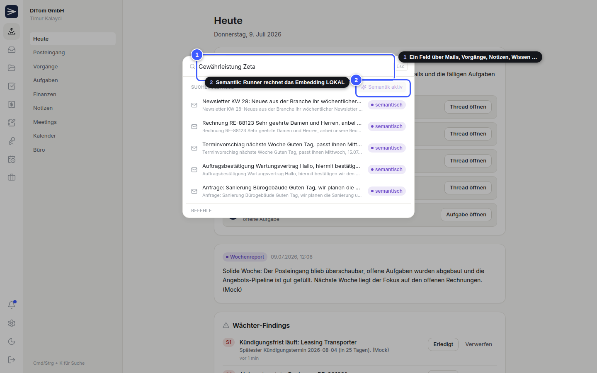

### 11 · Team, Kalender & Wochenreport (Etappe 5)

**Geteiltes Postfach.** Threads lassen sich einem Mitglied zuweisen (`assign_thread`,
Member-Check serverseitig) und **intern kommentieren mit @Mentions** (`thread_comments` →
Benachrichtigung kind='mention') — kein Weiterleiten-Chaos.

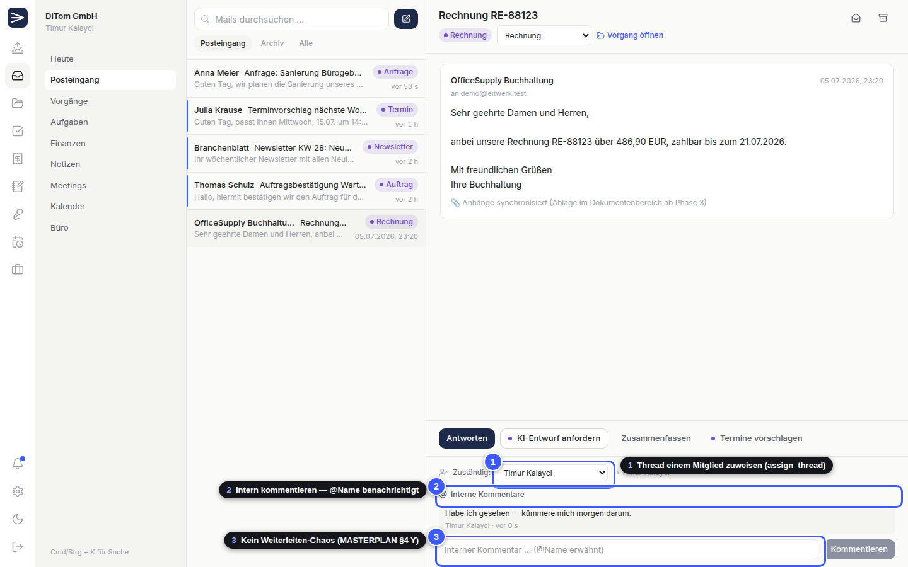

**Kalender mit KI-Kontext-Briefing.** Termine kommen per Google-Sync über den Runner
(kurzlebiges Token aus dem Vault). Vor jedem baldigen Termin (≤ 24 h) erzeugt
`calendar_briefing` automatisch ein Kontext-Briefing aus offenen Vorgängen und letzten
Mails der Teilnehmer (violett = KI). Darunter der Fristenkalender (wiederkehrende
Pflichten als Aufgaben).

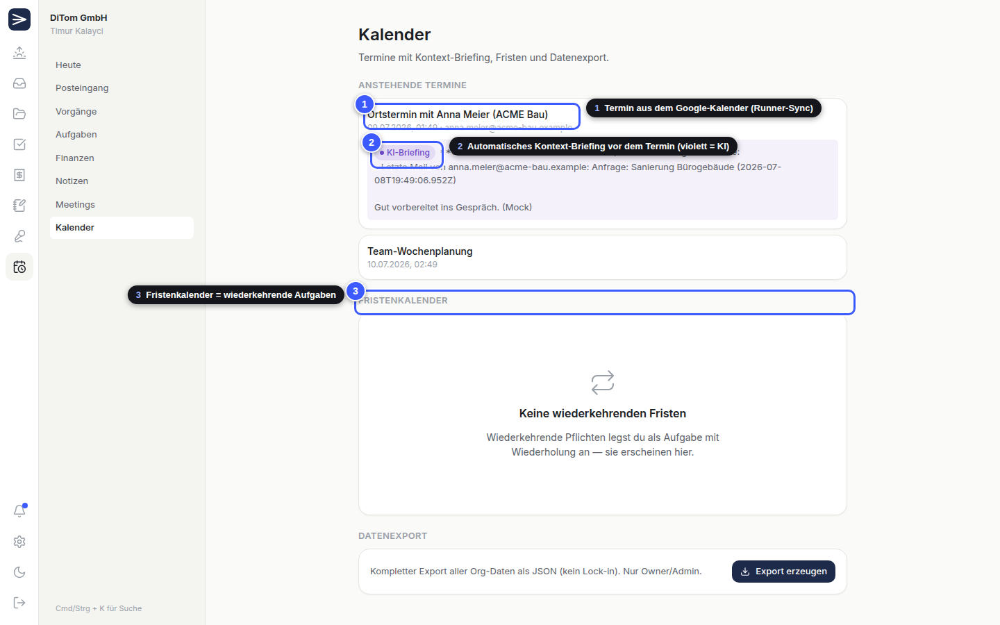

**Datenexport (kein Lock-in).** Ein Klick erzeugt einen kompletten JSON-Snapshot aller
org-scoped Tabellen im Bucket `exports` (signierte URL) — nur Owner/Admin. Die Daten
gehören dem Nutzer, jederzeit vollständig entnehmbar.

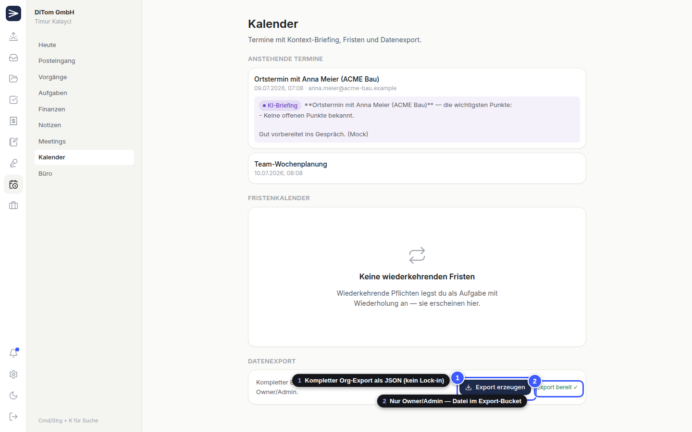

**Wochenreport.** Freitags fasst `weekly_report` die Woche zusammen (bearbeitete Mails,
erledigte Aufgaben, versendete/bezahlte Rechnungen, Angebots-Pipeline, KI-Trefferquote) →
`briefings` kind='weekly'. „Heute“ zeigt den Rückblick als eigene Karte.

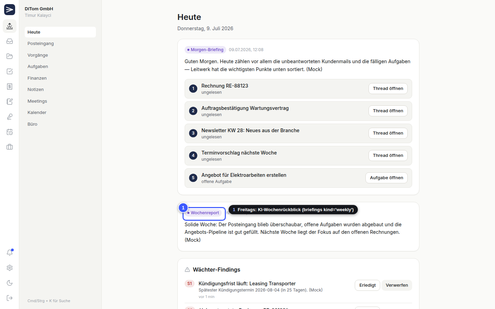

### 12 · Büro: Zeit, Bank, DATEV, Verträge & Anrufe (Etappe 6)

**Zeiterfassung.** Zeiten manuell erfassen — oder der Runner schlägt sie per
`time_suggest` aus Vorgängen/Mails vor (violett, Bestätigung durch den Nutzer).
Abrechenbare Stunden fließen per RPC `bill_time_entries` als Positionen (Snapshot
`hourly_rate`) direkt in eine Rechnung und werden danach gesperrt — keine
Doppelabrechnung.

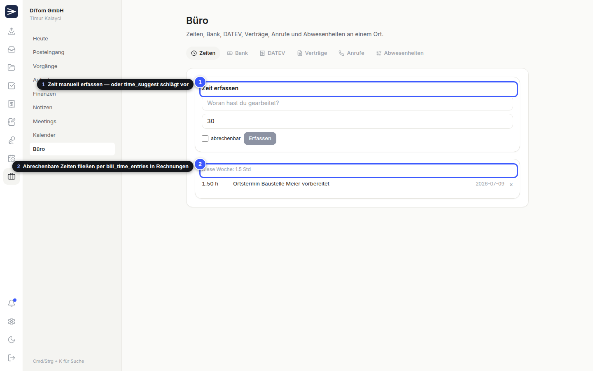

**Zahlungsabgleich.** `payment_match` ordnet Bankumsätze offenen Ausgangsrechnungen zu
(violett, `payment_matches` status='suggested'). Bestätigen setzt die Rechnung auf `paid`
und **stoppt laufende Mahnungen** (`process_overdue_invoices` überspringt bestätigte
Matches). Bank-Zugangsdaten bleiben im Vault, nie im Client.

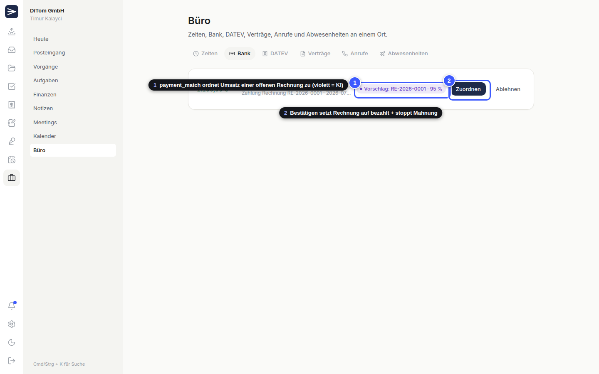

**DATEV-EXTF-Export.** Der Buchungsstapel (EXTF Format 700) geht an den Steuerberater —
erzeugt vom Deno-freien Builder `datev.ts`, **byte-genau abgesichert durch einen
Golden-File-Test**. Der Kontenrahmen (SKR03/04) bleibt in dessen Hoheit; bereits
exportierte Belege werden über `export_items` gesperrt (kein Doppel-Export).

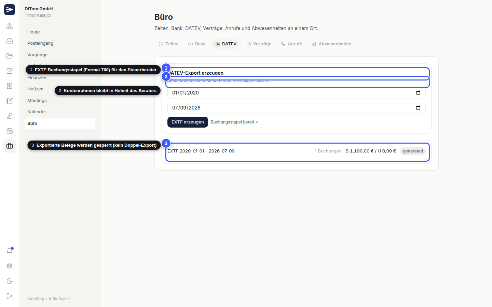

**Verträge & Kündigungs-Wächter.** `extract_contract` liest Eckdaten (Laufzeit,
Kündigungsfrist, Kosten) aus dem Vertrags-PDF (violett). Der tägliche `contract_watch`
warnt gestaffelt (90/60/30 Tage) über `case_findings` kind='risk' — nichts läuft mehr
unbemerkt aus.

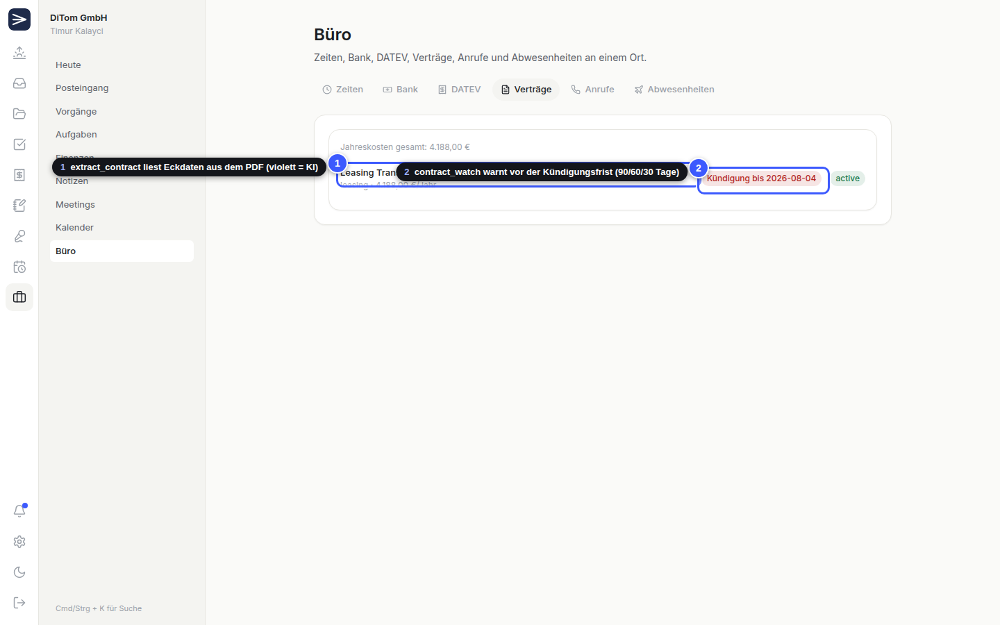

**Anrufnotiz.** Anrufe schnell festhalten; Sprachnotizen transkribiert der Runner
**lokal** (`transcribe_call`, whisper.cpp) und fasst sie per Folgejob `summarize_call`
zusammen — inklusive Folge-Aufgabe und Case-Event am Vorgang.

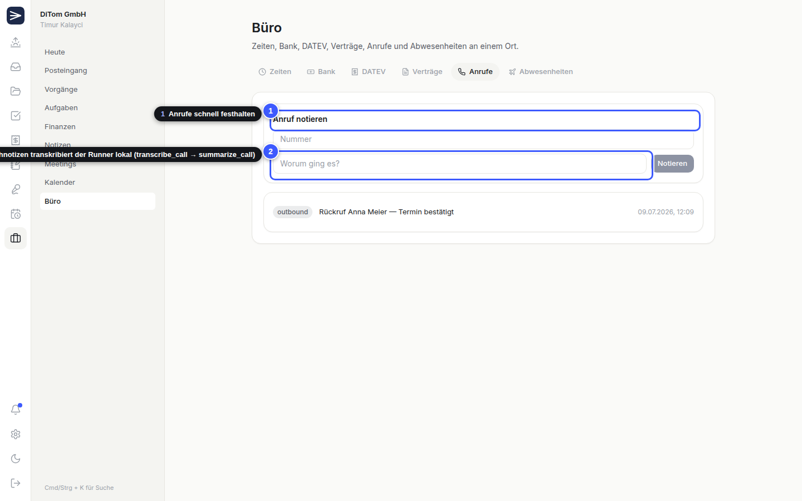

### 13 · Regel-Engine light (Einstellungen → Regeln)

**Regel-Builder.** Wenn-Dann-Regeln pro Organisation: „Wenn *Ereignis* und *Bedingungen*,
dann *Aktion*“. Ereignisse wie `mail_received`, `invoice_captured`, `quote_sent` oder
`payment_matched` werden von den Modulen ausgelöst; Bedingungen prüfen Felder der Entity
(UND-verknüpft). Ausgewertet wird serverseitig durch `evaluate_org_rules`.

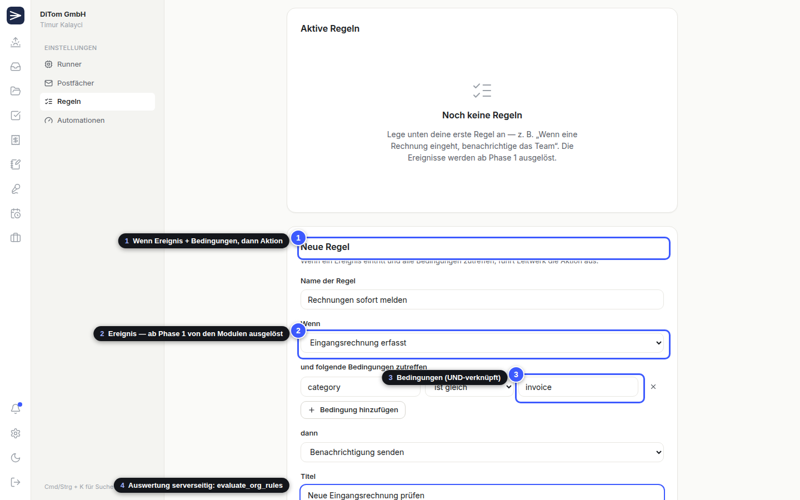

**Regel aktiv.** Angelegte Regeln lassen sich jederzeit pausieren oder löschen; jede
Ausführung landet im Audit-Log (`rule.executed`).

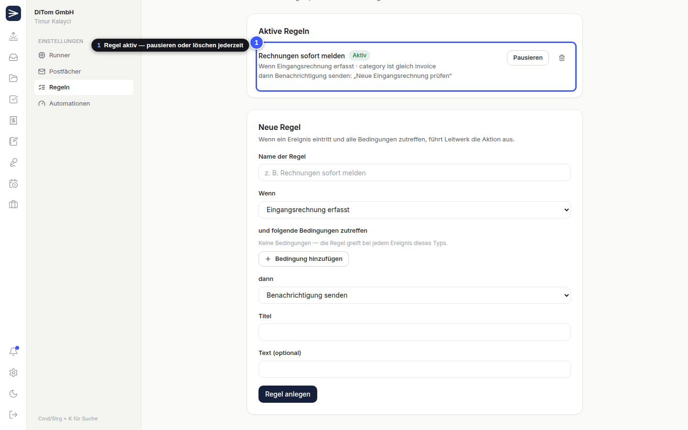

### 14 · Dark Mode

Ein Klick auf den Mond in der Icon-Rail schaltet das vollwertige dunkle Theme um — alle
Design-Tokens aus `docs/DESIGN.md`, inklusive angepasster Marken- und KI-Farben. Die Wahl
wird gespeichert; ohne Wahl gilt die Systemeinstellung.

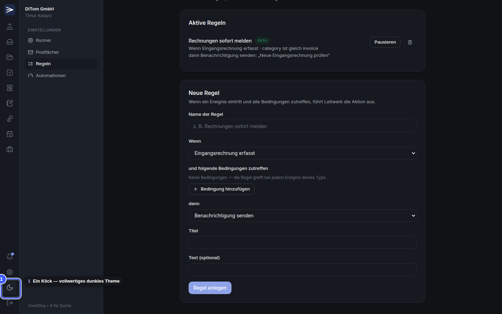

---

## Roadmap

Aus [docs/MASTERPLAN.md](docs/MASTERPLAN.md) §8 — jede Phase endet mit etwas täglich
Nutzbarem. Fertige Prompts pro Phase: [docs/ROADMAP_PROMPTS.md](docs/ROADMAP_PROMPTS.md).

| Phase | Umfang | Status |
|---|---|---|
| **P0 — Fundament** | Monorepo, Migrationen, Auth + Orgs, Onboarding, Runner-Pairing, Echo-Job Ende-zu-Ende, CI | ✅ **fertig** |
| **P0.5 — Security-Härtung** | Zwei-Stufen-Pairing, Rate-Limits, Abo-Schutz (Limits + Nachtfenster), Regel-Engine light, `service install` | ✅ **fertig** |
| **P1 — E-Mail-Hub** | Gmail-OAuth + Sync, Inbox (lesen/schreiben/senden mit 30s-Rückholen), `classify_email` + `case_match` + `draft_reply` + `thread_summary`, Vorgangsakte v1 → ab hier Dogfooding | ✅ **fertig** |
| **P2 — Aufgaben & Briefing** | Aufgaben-Compiler (`extract_commitments`), Follow-up-Engine, Nacht-Wächter (`gap_scan`), Morgen-Briefing, Web-Push | ✅ **fertig** |
| **P3 — Finanzen** | Eingangsrechnungs-Erfassung + Prüf-Workflow, Angebote/Rechnungen inkl. **XRechnung-XML** (EN 16931), Mahnwesen, Nummernkreise | ✅ **fertig** |
| **P4 — Autonomie & Wissen** | Autonomie-Regler-UI mit Trefferquoten (TrustMeter), serverseitiges Hochstufen-Gate, Stufe-3-Halte-Zone, Notizen, `knowledge_distill`, semantische Suche (pgvector), Meetings (Whisper lokal) | ✅ **fertig** |
| **P5 — Team & Papierkram** | Geteilte Postfächer, Kommentare/@Zuweisungen, Fristenkalender, IMAP-Fallback, Kalender-Sync, Wochenreport | ✅ **fertig** |
| **P6 — Komplett-Büro** | Zeiterfassung + Abwesenheiten, Banking-Sync + Zahlungsabgleich, **DATEV-EXTF-Export** (Golden-File), Anrufprotokolle, Vertragsregister mit Kündigungs-Wächter | ✅ **fertig** |
| **P7 — Produktisierung** | Onboarding-Polish, Landing Page, Preismodell („keine KI-Kosten beim Anbieter“), gehosteter Runner als Option, Pen-Test | offen |

Der Job-Typen-Katalog des Runners (14 Skills von `classify_email` bis `weekly_report`)
steht in [docs/MASTERPLAN.md](docs/MASTERPLAN.md) §5.

## Repo-Struktur

| Pfad | Inhalt |
|---|---|
| `apps/pwa` | React 18 + Vite + TS (strict) + Tailwind 4 + TanStack Query + Zustand, installierbar als PWA |
| `apps/runner` | `leitwerk-runner` — Node-20-CLI-Daemon (Pairing, Poll-Loop, Skills, Provider-Adapter) |
| `packages/shared` | Zod-Schemas, Job-/Broker-Typen, Konstanten, Geld-Utils (Cent-Integer, de-DE) |
| `packages/ui` | Design-System nach `docs/DESIGN.md` (Tokens Light/Dark, AiBadge, EmptyState, …) |
| `supabase/` | 22 Migrationen + Edge Functions (Deno): `runner-broker`, `build-job-context`, `oauth-gmail`, `mail-sync`, `calendar-sync`, `send-mail`, `send-push`, `export-xrechnung`, `export-org` |
| `migrations/` | **Verbindliche Datenmodell-Wahrheit** — Code folgt dem Schema, nicht umgekehrt |
| `tools/mock-server` | Lokales Mock-Backend (ersetzt Supabase zum Testen) + Mock-Claude-CLI |
| `tools/e2e-tutorial` | Playwright-Lauf: komplette User-Journey + annotierte Screenshots |
| `docs/` | [MASTERPLAN](docs/MASTERPLAN.md) · [DESIGN](docs/DESIGN.md) · [ROADMAP_PROMPTS](docs/ROADMAP_PROMPTS.md) · [CHANGELOG](docs/CHANGELOG.md) · [Test-Tutorial](docs/testing-tutorial/TUTORIAL.md) |
| `tutorials/` | Manuelle Betreiber-Schritte: Supabase, Google OAuth, Functions, Deployment, Runner, Banking/DATEV |

## Loslegen: lokale Test-Umgebung (ohne Supabase)

Der schnellste Weg, alles laufen zu sehen — kein Docker, kein Supabase, keine Secrets:

```bash
pnpm install
pnpm --filter leitwerk-runner build

# apps/pwa/.env anlegen:
#   VITE_SUPABASE_URL=http://127.0.0.1:54321
#   VITE_SUPABASE_ANON_KEY=mock-anon-key

node tools/mock-server/server.mjs            # Terminal 1: Mock-Backend (Port 54321)
pnpm --filter @leitwerk/pwa dev              # Terminal 2: PWA → http://localhost:5173

# Terminal 3: Runner pairen (Code in der PWA eingeben) und starten
node apps/runner/dist/index.js init --url http://127.0.0.1:54321/functions/v1
LEITWERK_CLAUDE_BIN="node tools/mock-server/claude-mock.cjs" node apps/runner/dist/index.js start
```

Schritt-für-Schritt mit Screenshots: **[docs/testing-tutorial/TUTORIAL.md](docs/testing-tutorial/TUTORIAL.md)**.

## Loslegen: mit Supabase (Produktions-Setup)

Voraussetzungen: Node ≥ 20, pnpm ≥ 9, [Supabase CLI](https://supabase.com/docs/guides/local-development) + Docker.

```bash
pnpm install
supabase start                                        # führt alle 16 Migrationen aus
cp apps/pwa/.env.example apps/pwa/.env                # anon key aus supabase start eintragen
cp supabase/functions/.env.example supabase/functions/.env   # RUNNER_TOKEN_PEPPER setzen
supabase functions serve --env-file supabase/functions/.env  # eigenes Terminal
pnpm dev                                              # PWA → http://localhost:5173
```

Hosted-Deployment (Secrets, Functions, pg_cron, Typen-Generierung):
Deploy-Liste in [docs/CHANGELOG.md](docs/CHANGELOG.md), Details in [tutorials/](tutorials/).

Nützlich: `pnpm lint` · `pnpm test` · `pnpm build` · `node tools/e2e-tutorial/run.mjs` (Screenshots neu erzeugen)

## Dokumentation

- **[MASTERPLAN.md](docs/MASTERPLAN.md)** — Produktdefinition A–Z, BYO-KI-Modell, Datenmodell, Sicherheit/DSGVO, Risiken
- **[DESIGN.md](docs/DESIGN.md)** — Design-System: Tokens, Typografie, Kernkomponenten, verbotene Muster
- **[ROADMAP_PROMPTS.md](docs/ROADMAP_PROMPTS.md)** — fertige Claude-Code-Prompts für jede Phase
- **[CHANGELOG.md](docs/CHANGELOG.md)** — was in welcher Phase entstand + manuelle Deploy-Schritte
- **[Test-Tutorial](docs/testing-tutorial/TUTORIAL.md)** — jedes Feature mit annotiertem Screenshot
- **[tutorials/](tutorials/)** — manuelle Betreiber-Schritte (Supabase, OAuth, Deployment, Runner, Banking/DATEV)

---

**Tech-Stack:** React 18 · Vite 6 · TypeScript strict · Tailwind 4 · TanStack Query · Zustand ·
Supabase (Postgres 15 + pgvector, RLS, Edge Functions/Deno) · Node 20 · Zod · Vitest · Playwright ·
pnpm + Turborepo
