# Leitwerk Phase 0 — Test-Tutorial (lokal, ohne Supabase)

Dieses Tutorial zeigt **jedes Phase-0-Feature** mit annotierten Screenshots — aufgenommen
gegen die **lokale Mock-Umgebung**, die komplett ohne Supabase/Docker läuft. Alle
Screenshots stammen aus einem automatisierten Ende-zu-Ende-Lauf
(`tools/e2e-tutorial/run.mjs`) und lassen sich jederzeit reproduzieren.

> ⚠️ Die Mock-Umgebung ist **nur zum Testen/Demonstrieren**. Produktion läuft
> ausschließlich auf Supabase (siehe `CLAUDE.md` und `docs/CHANGELOG.md`).

---

## Die Test-Umgebung starten

Drei Bausteine ersetzen Supabase + echte KI:

| Baustein | Ersetzt | Start |
|---|---|---|
| `tools/mock-server/server.mjs` | Supabase (Auth, Datenbank, Edge Functions) auf Port 54321 | `node tools/mock-server/server.mjs` |
| `tools/mock-server/claude-mock.cjs` | Claude CLI (deterministische KI-Antwort) | wird vom Runner aufgerufen |
| `apps/pwa/.env` | Supabase-Zugangsdaten | siehe unten |

```bash
# 0. Einmalig: Abhängigkeiten + Runner bauen
pnpm install
pnpm --filter leitwerk-runner build

# 1. apps/pwa/.env anlegen (Mock-Werte, keine Secrets):
#    VITE_SUPABASE_URL=http://127.0.0.1:54321
#    VITE_SUPABASE_ANON_KEY=mock-anon-key

# 2. Mock-Backend starten (Terminal 1)
node tools/mock-server/server.mjs

# 3. PWA starten (Terminal 2)  →  http://localhost:5173
pnpm --filter @leitwerk/pwa dev

# 4. Runner pairen & starten (Terminal 3) — Code kommt aus Schritt 6 unten
node apps/runner/dist/index.js init --url http://127.0.0.1:54321/functions/v1
LEITWERK_CLAUDE_BIN=tools/mock-server/claude-mock.cjs \
LEITWERK_GMAIL_API_URL=http://127.0.0.1:54321/gmail/v1/users/me \
node apps/runner/dist/index.js start
```
`LEITWERK_GMAIL_API_URL` zeigt auf die Mini-Gmail-API des Mocks (Etappe 1) —
„Gmail verbinden“ legt dann ein **Demo-Postfach** mit fünf Beispiel-Mails an.

Screenshots neu erzeugen: `node tools/e2e-tutorial/run.mjs`
(Mock-Backend + PWA müssen laufen; vorher `tools/mock-server/data/` löschen für einen frischen Stand).

**Hinweise zur Mock-Umgebung:**
- Realtime (WebSocket) gibt es im Mock nicht — die PWA aktualisiert per Polling
  (Runner alle 30 s, Jobs alle 15 s) und beim Fenster-Fokus. In Produktion mit
  Supabase kommen Updates live per Realtime.
- Die Daten liegen in `tools/mock-server/data/db.json` — Datei löschen = frischer Stand.
- Die Mock-KI antwortet deterministisch; mit echter Claude CLI (`claude login`)
  einfach `LEITWERK_CLAUDE_BIN` weglassen.

---

## 1 · Anmelden

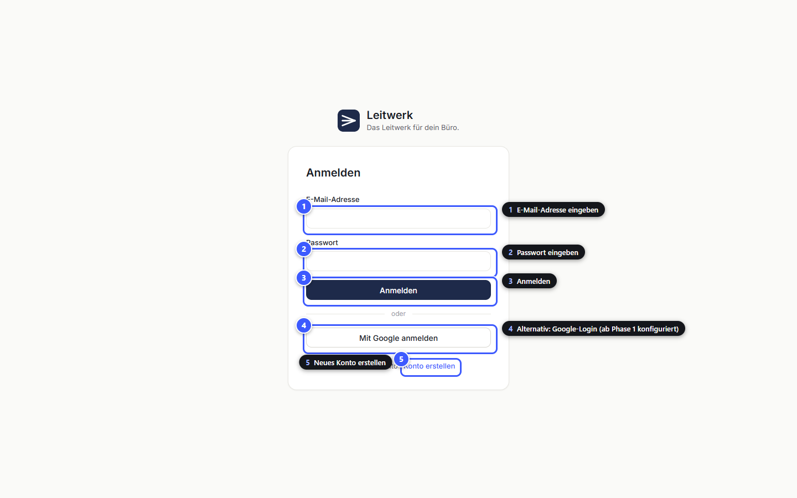

Der Einstiegspunkt der PWA. **(1)** E-Mail und **(2)** Passwort für bestehende Konten,
**(3)** meldet an. **(4)** Google-Login ist vorbereitet (aktiv, sobald der Betreiber die
OAuth-App nach `tutorials/02_google_oauth.md` registriert hat). Neue Nutzer gehen über
**(5)** zur Registrierung. Fehleingaben zeigen eine deutsche Fehlermeldung unter dem Formular.

## 2 · Konto erstellen

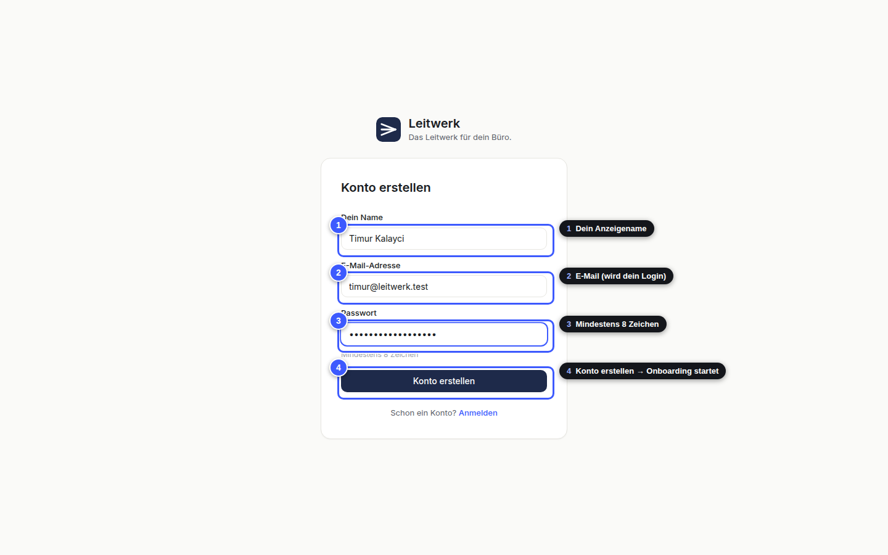

**(1)** Anzeigename (landet als `display_name` im Profil), **(2)** E-Mail als Login,
**(3)** Passwort mit Mindestlänge. **(4)** legt das Konto an — dabei entsteht automatisch
das Profil (Trigger aus Migration 001) — und startet direkt das Onboarding.

## 3 · Organisation anlegen

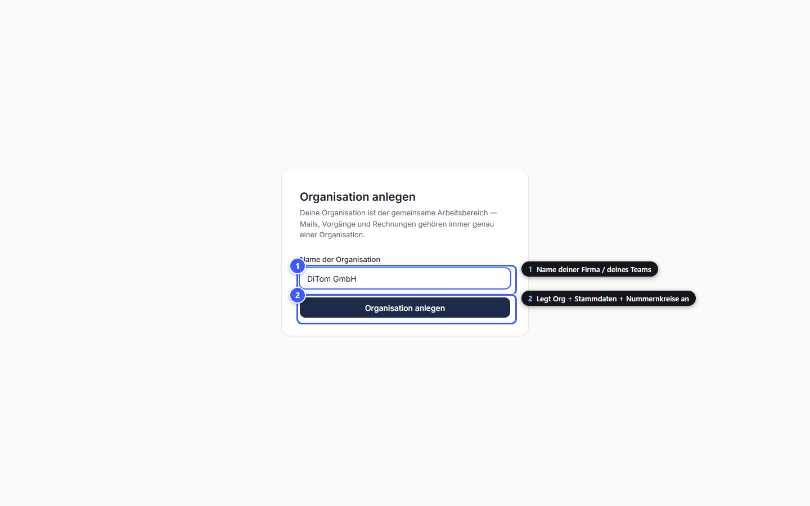

Leitwerk ist multi-tenant: Alles (Mails, Vorgänge, Rechnungen, Jobs) gehört genau einer
Organisation. **(1)** Name eingeben, **(2)** anlegen. Im Hintergrund passiert viel
(Migrationen 010 + 016): Der Ersteller wird **Owner**, Firmen-Stammdaten, vier
Nummernkreise und sieben Standard-Automationen (alle auf Autonomie-Stufe 1) werden angelegt.

## 4 · Onboarding Schritt 1: Firmen-Stammdaten

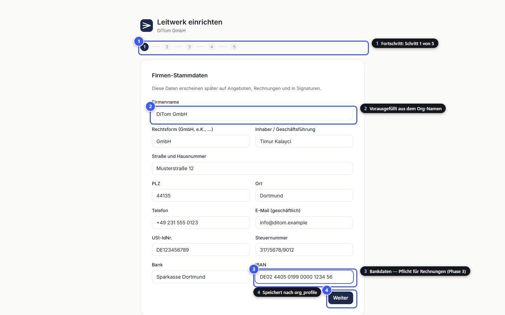

**(1)** Der Fortschrittsbalken zeigt die 5 Schritte; erledigte Schritte sind klickbar.
**(2)** Der Firmenname ist aus dem Org-Namen vorausgefüllt. **(3)** Bankdaten braucht
Phase 3 für Rechnungen (ZUGFeRD/XRechnung). **(4)** speichert alles nach `org_profile`
und setzt das Onboarding-Flag `company_done`.

## 5 · Onboarding Schritt 2: Postfach (Platzhalter)

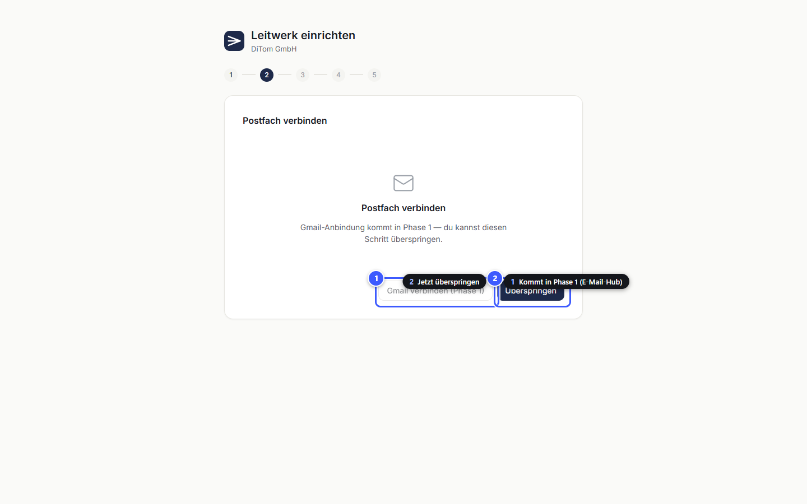

**(1)** Die Gmail-Anbindung ist Phase 1 (E-Mail-Hub) — der Button ist bewusst deaktiviert
statt versteckt, damit klar ist, was kommt. **(2)** überspringt den Schritt.

## 6 · Onboarding Schritt 3: Runner verbinden (Pairing)

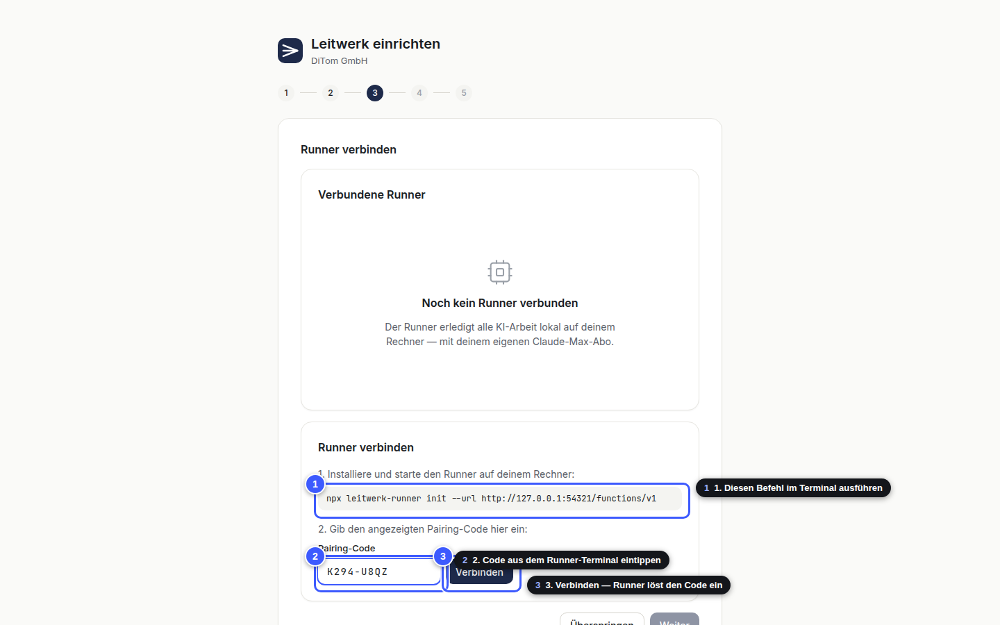

Das Herzstück des BYO-KI-Modells: **(1)** Der Nutzer startet den Runner auf seinem
Rechner — der Runner zeigt im Terminal einen 8-stelligen Pairing-Code an und pollt den
Broker (alle 7 s, bewusst unter dem IP-Rate-Limit von 10 Versuchen/Minute).
**(2)** Den Code in der PWA eintippen, **(3)** verbinden. Die PWA legt den Code
in `runner_pairing_codes` ab (10 Minuten gültig); beim nächsten Poll löst der Runner ihn
ein und erhält sein **Runner-Token** (nur als Hash in der DB — der Klartext existiert
genau einmal in dieser Antwort). Nach 5 Fehlversuchen ist ein Code dauerhaft gesperrt.

## 7 · Runner-Freigabe (Zwei-Stufen-Pairing)

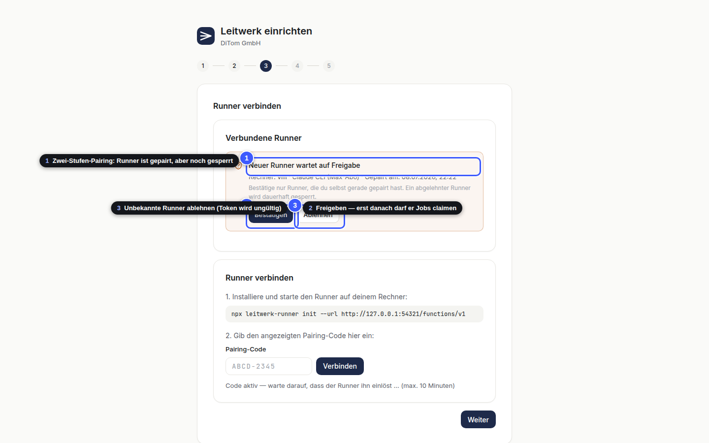

Etappe 0.5: Ein frisch gepairter Runner startet als **`pending_approval`** und darf
nichts claimen — `claim_next_job` und die Broker-Authentifizierung lehnen ihn ab.
**(1)** Die PWA zeigt Hostname, Provider und Pairing-Zeitpunkt. **(2)** Erst die
Bestätigung durch Owner/Admin (`approve_runner`) schaltet den Runner auf `online`.
**(3)** „Ablehnen“ (`reject_runner`) sperrt ihn dauerhaft — das Token wird unbrauchbar.
Ein erratener Pairing-Code allein reicht damit nicht mehr für Datenzugriff.

## 8 · Runner verbunden

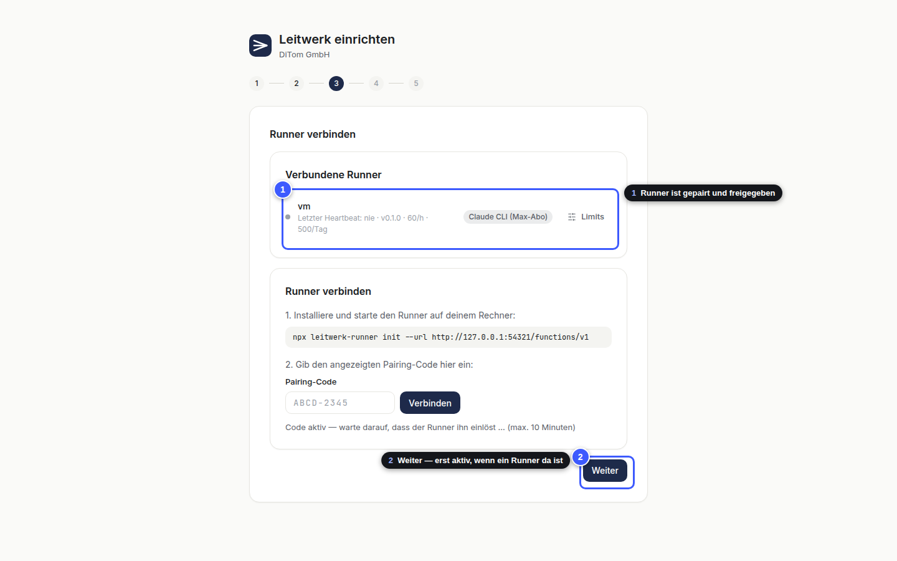

**(1)** Der Runner erscheint mit Hostname, Heartbeat und Provider-Badge
(„Claude CLI (Max-Abo)“). Das Onboarding-Flag `runner_paired` wird automatisch gesetzt.
**(2)** „Weiter“ ist erst aktiv, wenn mindestens ein Runner verbunden ist —
überspringen geht trotzdem.

## 9 · Onboarding Schritt 4: Nummernkreise


**(1)** Die vier automatisch angelegten Nummernkreise mit Vorschau der nächsten Nummer:
Vorgänge (`V-2026-0001`), Angebote (`AN-`), Rechnungen (`RE-`), Mahnungen (`MA-`).
**(2)** bestätigt — anpassen lassen sie sich später in den Einstellungen (Phase 3).

## 10 · Onboarding abgeschlossen

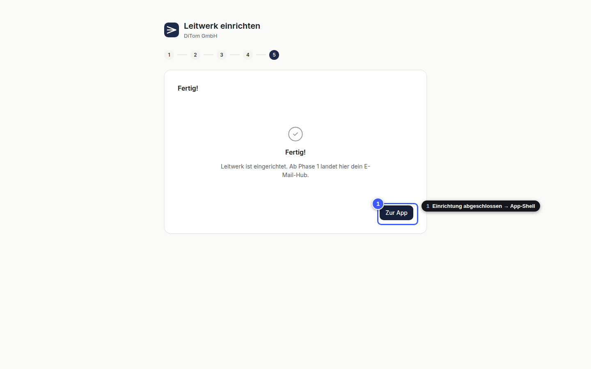

**(1)** führt in die App-Shell. Das Onboarding merkt sich seinen Stand pro Flag —
wer es unterbricht, landet beim nächsten Besuch am ersten offenen Schritt.

## 11 · App-Shell: „Heute“


Das Layout nach `docs/DESIGN.md`: **(1)** Icon-Rail (56 px) mit den fünf Hauptmodulen,
**(2)** Kontext-Sidebar mit aktiver Organisation und Nutzer. **(3)** „Heute“ wird ab
Phase 2 das Morgen-Briefing — bis dahin führt der Empty-State ehrlich zum nächsten
sinnvollen Schritt. **(4)** Einstellungen und **(5)** Theme-Umschalter unten in der Rail.

## 12 · Modul-Platzhalter

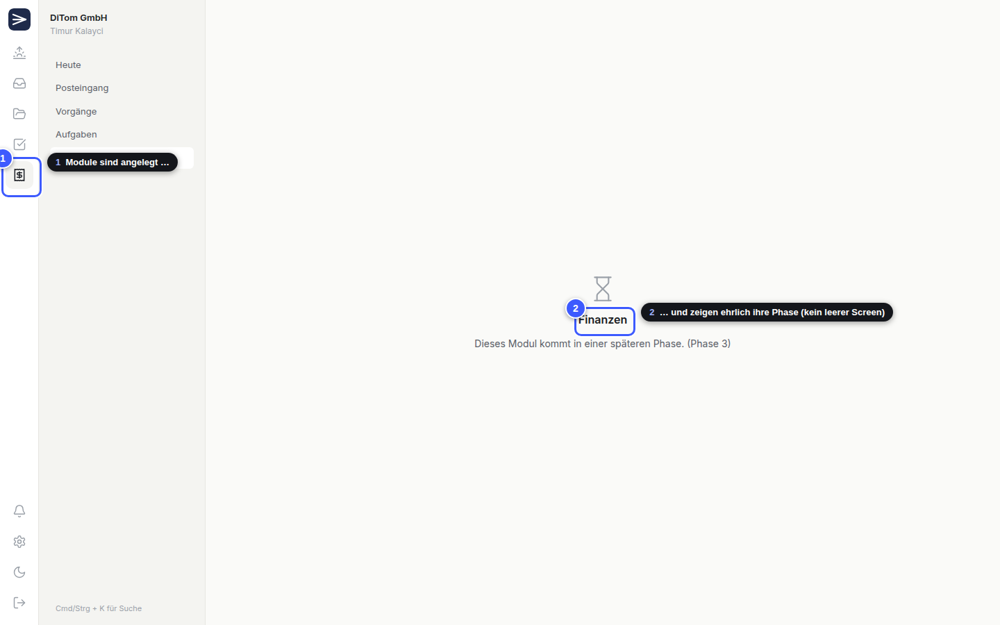

**(1)** Alle Module sind navigierbar, **(2)** noch nicht gebaute zeigen statt leerer
Flächen einen Empty-State mit ihrer Phase (Finanzen → Phase 3). Posteingang, Vorgänge
(Etappe 1) und Aufgaben (Etappe 2) sind produktiv — Abschnitte 18–30.
Kein Feature ohne Empty-State — Regel 9 aus `CLAUDE.md`.

## 13 · CommandBar (Strg/Cmd + K)

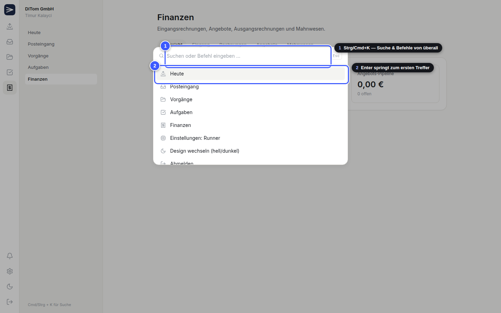

**(1)** Von überall per Strg/Cmd+K: Navigation und Befehle (Theme wechseln, Abmelden),
gefiltert beim Tippen. **(2)** Enter springt zum ersten Treffer, Esc schließt.
In Phase 4 wird daraus die globale Suche (Volltext + semantisch).

## 14 · Einstellungen → Runner

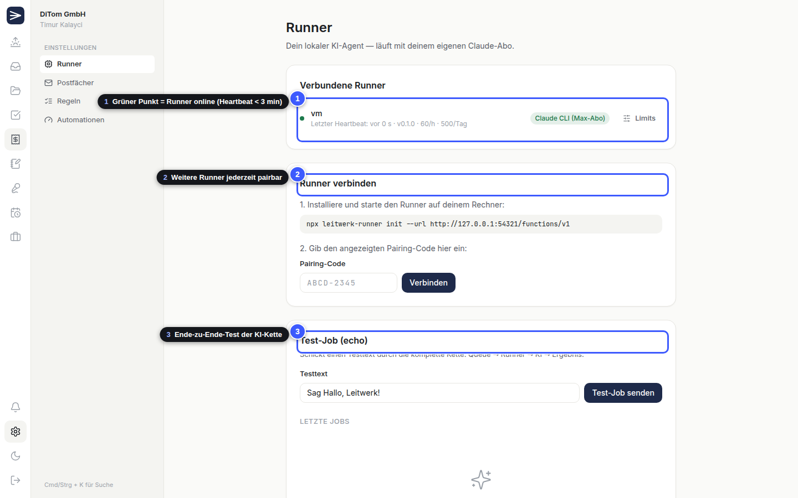

Die Kommandozentrale für den KI-Agenten: **(1)** Verbundene Runner mit Live-Status —
grüner Punkt bedeutet Heartbeat jünger als 3 Minuten (dieselbe Schwelle nutzt der
Watchdog serverseitig). **(2)** Weitere Runner (Zweitrechner, VPS) jederzeit pairbar.
**(3)** Der Test-Job prüft die komplette KI-Kette. Ist kein Runner online, erscheint
oben ein Hinweis-Banner — der Rest der App bleibt voll benutzbar.

## 15 · Abo-Schutz: Limits & Nachtfenster

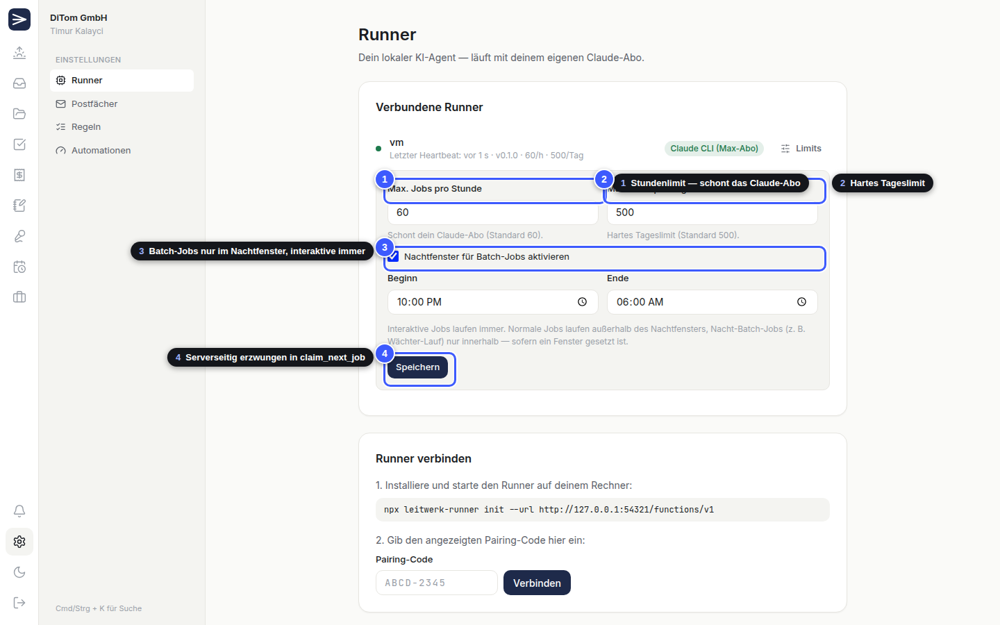

Etappe 0.5: **(1)** Max. Jobs pro Stunde und **(2)** pro Tag schützen das Claude-Abo —
gezählt über die `claimed`-Ereignisse in `agent_job_events` (rollierende Fenster
60 min/24 h), erzwungen **serverseitig** in `claim_next_job`, nicht nur im UI.
**(3)** Das optionale Nachtfenster steuert, wann welche Jobs laufen: interaktive Jobs
(Priorität ≤ 2) immer, normale Jobs nur außerhalb, Nacht-Batch (Priorität ≥ 8) nur
innerhalb des Fensters. **(4)** speichert direkt auf dem Runner-Datensatz — der Client
darf per Spalten-Grant nur diese Felder ändern (Status/Token bleiben Broker-Sache).

## 16 · Test-Job senden

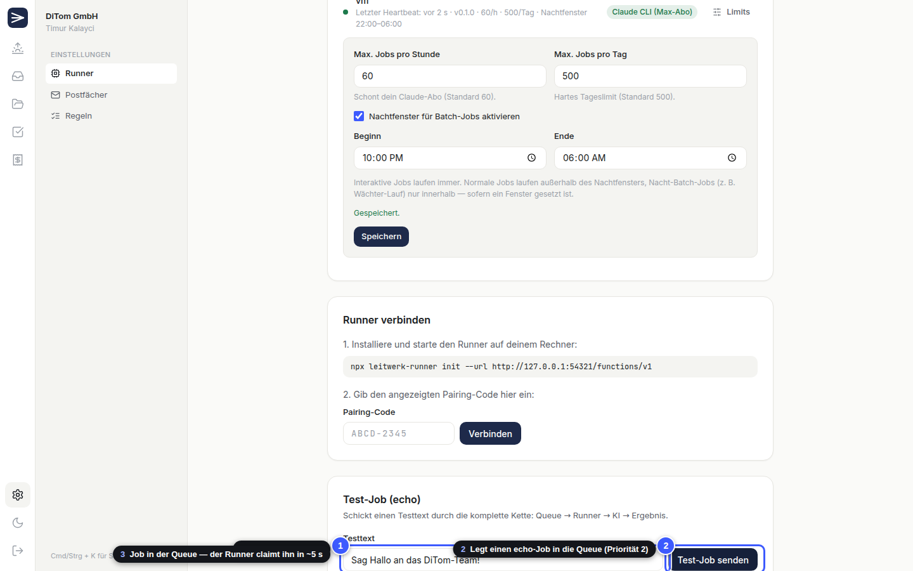

**(1)** Beliebigen Testtext eingeben, **(2)** senden — das legt einen `echo`-Job mit
Priorität 2 (interaktiv) in die Queue. **(3)** Der Job erscheint sofort als „Wartet“.
Der Runner pollt alle 5 Sekunden, claimt den Job (Prioritäts-Sortierung, ein Versuch
von maximal 3) und holt sich den Kontext von der Edge Function `build-job-context`.

## 17 · KI-Antwort

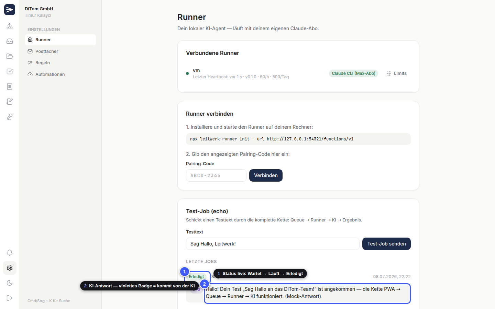

**(1)** Der Status läuft live durch: Wartet → Läuft → **Erledigt**. **(2)** Die Antwort
der KI — das violette **KI-Badge** markiert überall in Leitwerk, was von der Maschine
kommt (eiserne Design-Regel: Violett gibt es nur dafür). Der Runner hat den Prompt aus
dem Kontext gebaut, die (Mock-)KI ausgeführt, die Antwort strikt mit Zod geparst und
das Ergebnis mit Idempotenz-Hash über den Broker abgeliefert. Schlägt das Parsen fehl,
gibt es genau einen **schlanken Reparatur-Versuch** (nur Schema-Beschreibung +
fehlerhafte Antwort, gekürzt auf 2000 Zeichen — nicht der komplette Original-Prompt);
danach greift der Backoff-Retry der Queue.

## 18 · Postfach verbinden (Etappe 1)

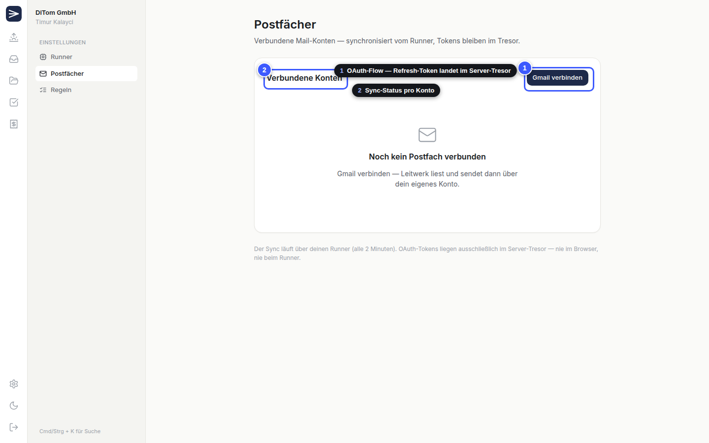

**(1)** „Gmail verbinden“ startet den OAuth-Flow über die Edge Function `oauth-gmail`:
Der Browser sieht nur die Google-URL und den Redirect — das Refresh-Token wandert
direkt in den **Supabase Vault** (Regel 1: Tokens nie im Client). **(2)** Danach
erscheint das Konto mit Live-Sync-Status. Im Mock ersetzt ein Demo-Postfach mit fünf
Beispiel-Mails den echten Google-Flow.

## 19 · Konto verbunden

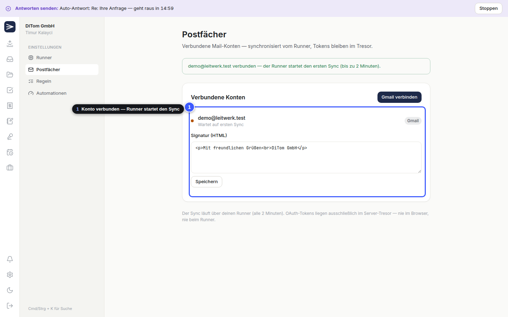

**(1)** Der Runner übernimmt den Sync (Initial: 90 Tage, danach Delta über die
Gmail-History-API alle 2 Minuten). Er bekommt dafür nur ein **kurzlebiges**
Access-Token von der Edge Function `mail-sync` — nie das Refresh-Token. Geschrieben
wird ausschließlich über `/ingest` (Dedupe über Unique-Constraints, Regel 2 + 6).

## 20 · Inbox mit KI-Kategorien

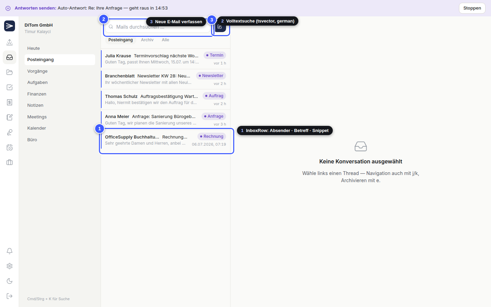

**(1)** Die InboxRow nach DESIGN.md: Absender · Betreff · Snippet, rechts
Kategorie-Chip + Zeit; ungelesen = 2px-Akzentbalken links. Die Kategorien (Anfrage,
Rechnung, Auftrag, Termin, Newsletter …) stammen von `classify_email` — violett,
weil KI-Herkunft. Korrektur per Dropdown fließt als `outcome='corrected'` in die
Trefferquote zurück (Regel 5). **(2)** Volltextsuche über `tsvector` (german),
**(3)** neue E-Mail verfassen. Tastatur: j/k navigiert, e archiviert.

## 21 · Thread mit Auto-Vorgang

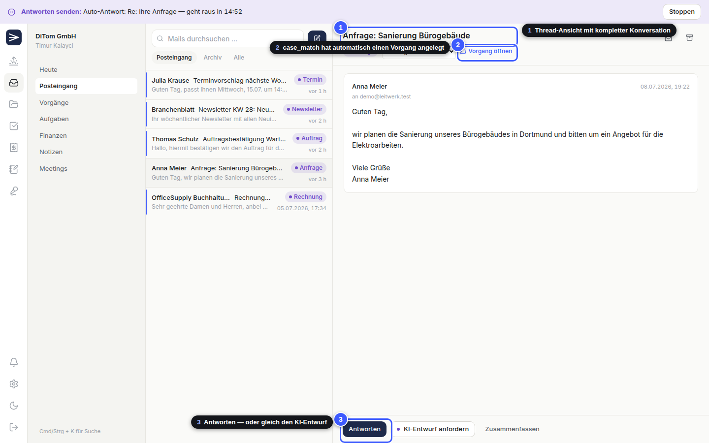

**(1)** Die Thread-Ansicht mit kompletter Konversation. **(2)** `case_match` hat den
Thread automatisch einem Vorgang zugeordnet (Konfidenz ≥ `min_confidence` der
Automation, serverseitig erzwungen im `apply_job_result`-Trigger). Unterhalb der
Schwelle erscheint stattdessen ein violetter **Vorschlags-Banner** mit
Übernehmen/Ablehnen — beides speist die Trefferquote. **(3)** Antworten manuell
oder per KI-Entwurf.

## 22 · KI-Entwurf

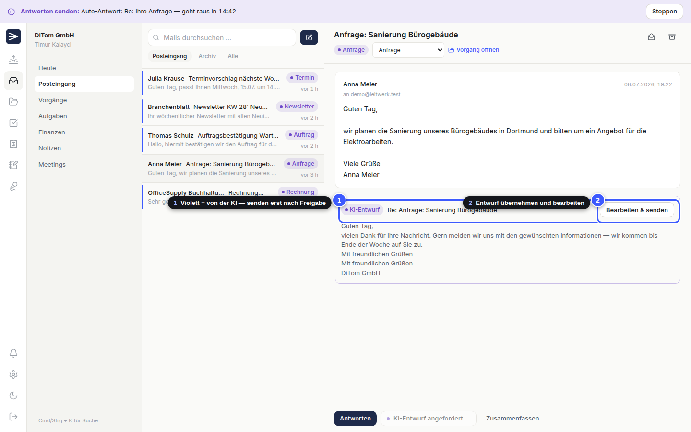

**(1)** `draft_reply` schreibt den Entwurf in `mail_drafts` (source='ai') — violett
markiert, gesendet wird NIE ohne Freigabe (Regel 4). **(2)** „Bearbeiten & senden“
öffnet den Composer (Tiptap) mit dem Entwurf.

## 23 · Senden mit 30-Sekunden-Rückholen

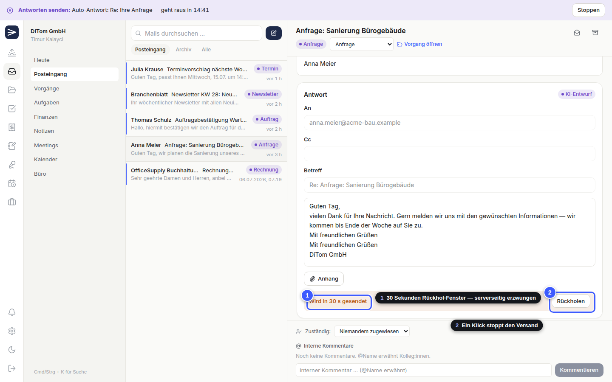

**(1)** Senden plant den Versand (`status='scheduled'`, `send_after = jetzt + 30 s`) —
die Edge Function `send-mail` erzwingt das Zeitfenster **serverseitig**, auch die
Stufe-3-Halte-Zone läuft später über denselben Mechanismus. **(2)** Ein Klick holt
die Mail zurück (Status zurück auf Entwurf).

## 24 · Gesendet

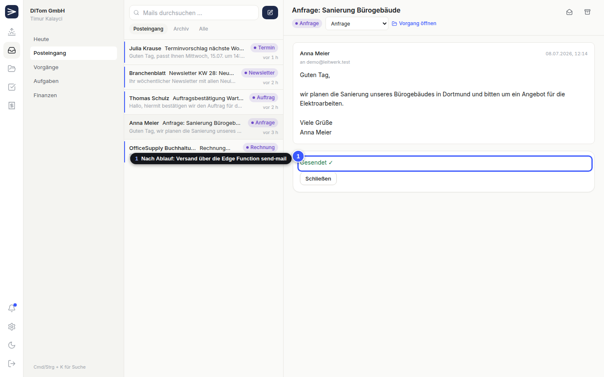

**(1)** Nach Ablauf des Fensters geht die Mail über die Gmail-API raus (MIME inkl.
Anhängen und Reply-Headern); die Outbound-Nachricht landet im Thread und in der
Vorgangs-Timeline (`mail_out`).

## 25 · Aufgaben-Compiler (Etappe 2)

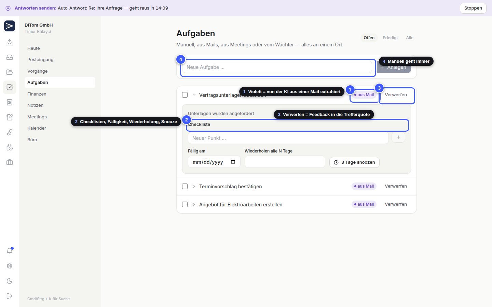

**(1)** `extract_commitments` übersetzt jede eingehende Mail in konkrete
Aufgaben-Vorschläge (source `mail_extract`, violett markiert). **(2)** Jede Aufgabe hat
Checklisten, Fälligkeit, einfache Wiederholung (alle N Tage) und 3-Tage-Snooze.
**(3)** „Verwerfen“ storniert den Vorschlag und meldet `outcome='wrong'` in die
Trefferquote (Regel 5). **(4)** Manuelle Aufgaben gehen jederzeit.

## 26 · Heute: Morgen-Briefing + Nacht-Wächter

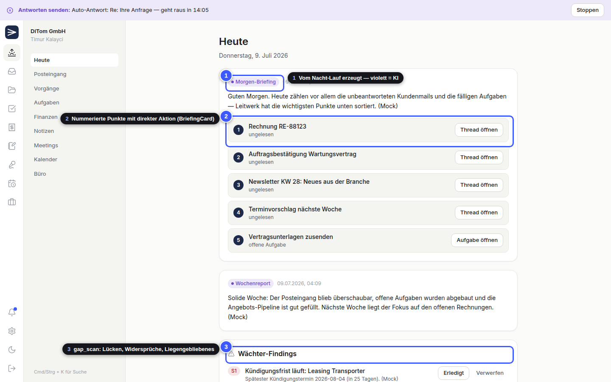

**(1)** `morning_briefing` fasst den Tag zusammen — violettes Badge = KI-Herkunft.
**(2)** Die BriefingCards (DESIGN.md Kernkomponente 9): nummerierte Punkte mit direkter
Aktion pro Punkt. **(3)** Darunter die Wächter-Findings aus `gap_scan` (hier: die
3 Tage unbeantwortete Rechnung) mit Erledigt/Verwerfen und die überfälligen Follow-ups
(`followup_check` eskaliert und erzeugt automatisch Nachfass-Entwürfe).

## 27 · Notification-Center + Web-Push

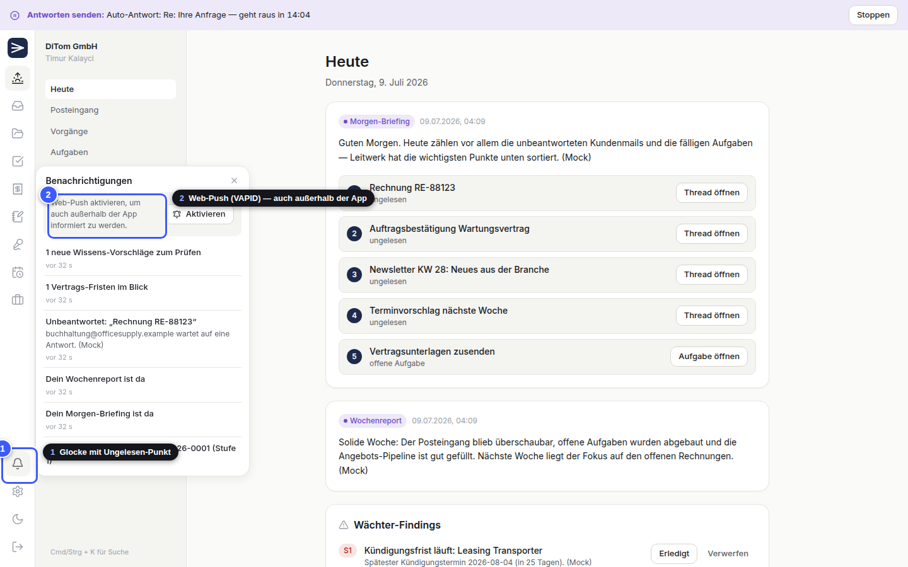

**(1)** Die Glocke in der Icon-Rail zeigt Ungelesenes; das Panel listet Findings,
Briefings und Zuweisungen. **(2)** Web-Push (VAPID): einmal aktivieren, dann stellt
die Edge Function `send-push` Benachrichtigungen auch außerhalb der App zu
(pg_cron + pg_net, notifications.pushed_at als Queue).

## 28 · Automationen mit TrustMeter

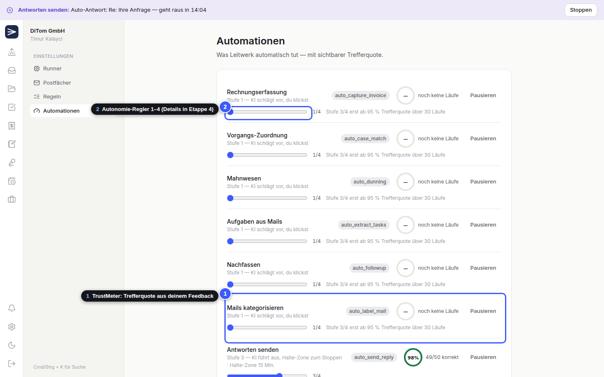

**(1)** Jede Automation zeigt ihre Trefferquote als TrustMeter-Ring (rollierendes
50er-Fenster aus `trust_stats`, gespeist von deinem Feedback). Grün wird der Ring
erst ab der Hochstufungs-Schwelle — der Autonomie-Regler selbst folgt in Phase 4.
**(2)** Ehrlicher Hinweis statt vorgezogener Regler.

## 29 · Vorgänge

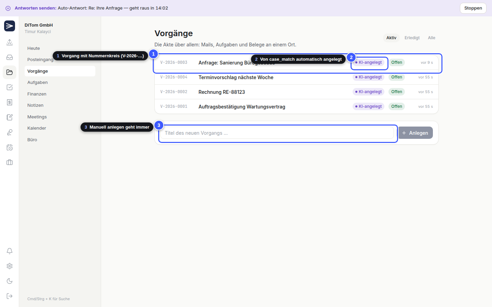

**(1)** Vorgänge mit Nummernkreis (`V-2026-…`), Status und letzter Aktivität.
**(2)** Von der KI angelegte Vorgänge tragen das violette Badge „KI-angelegt“.
**(3)** Manuell anlegen geht jederzeit (RPC `create_case`).

## 30 · Vorgangsakte

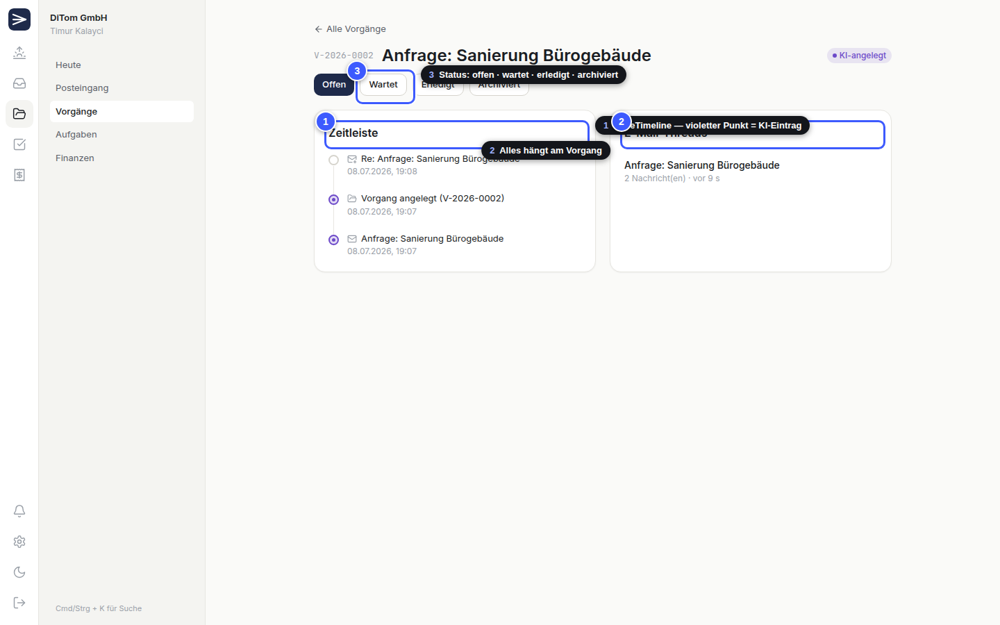

**(1)** Die CaseTimeline: jedes Ereignis (Anlage, Mail ein/aus, Verknüpfung) mit
Zeitstempel — **violetter Punkt = KI-Eintrag** (eiserne Design-Regel).
**(2)** Verknüpfte E-Mail-Threads; ab Phase 2/3 hängen hier auch Aufgaben und Belege.
**(3)** Status-Wechsel direkt in der Akte.

## 31 · Regel-Builder (Einstellungen → Regeln)

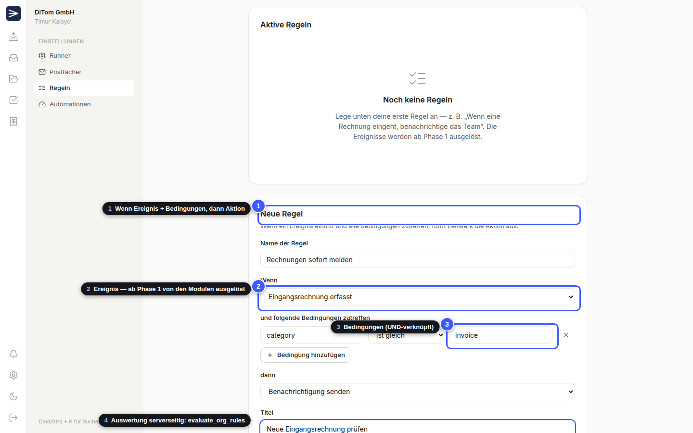

Die Regel-Engine light (Etappe 0.5): **(1)** Jede Regel folgt dem Muster „Wenn
*Ereignis* und *Bedingungen*, dann *Aktion*“. **(2)** Ereignisse wie `mail_received`,
`invoice_captured`, `quote_sent` oder `payment_matched` werden ab Phase 1 von den
Modulen ausgelöst. **(3)** Bedingungen prüfen Felder der Entity (UND-verknüpft, Operatoren
von „ist gleich“ bis „fehlt“). **(4)** Ausgewertet wird serverseitig durch die
Postgres-Funktion `evaluate_org_rules` — Aktionen: Benachrichtigung, Aufgabe oder KI-Job.

## 32 · Regel aktiv

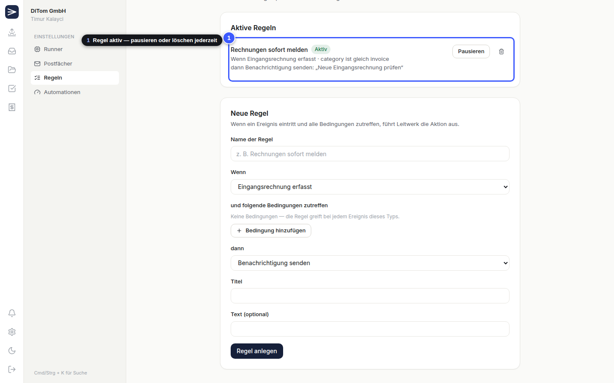

**(1)** Angelegte Regeln lassen sich jederzeit pausieren oder löschen; jede Ausführung
landet im Audit-Log (`rule.executed`). Seit Etappe 1 feuern `mail_received` und
`mail_sent` bei jeder synchronisierten bzw. gesendeten Nachricht durch die Engine.

## 33 · Dark Mode


**(1)** Ein Klick auf den Mond in der Icon-Rail schaltet das vollwertige dunkle Theme um
(alle Design-Tokens aus `DESIGN.md`, inklusive angepasster Marken- und KI-Farben).
Die Wahl wird gespeichert; ohne Wahl gilt die Systemeinstellung.

---

## Was hier Ende-zu-Ende bewiesen ist (DoD P0 + Etappen 0.5, 1 und 2)

1. Registrierung → Org-Anlage → Onboarding-Wizard mit Stammdaten aus `org_profile` ✓
2. Runner-Pairing über Pairing-Code + Token-Hash, gehärtet mit Rate-Limit,
   Fehlversuchszähler und Zwei-Stufen-Freigabe (`pending_approval` → Bestätigung) ✓
3. Dummy-Job `echo` läuft komplett durch: PWA → Queue → Runner → KI → Ergebnis in der PWA ✓
4. Abo-Schutz (Limits + Nachtfenster) einstellbar, serverseitig in `claim_next_job` erzwungen ✓
5. Regel-Engine light: Regel anlegen, pausieren, löschen (Auswertung: `evaluate_org_rules`) ✓
6. **Etappe 1:** Postfach verbinden → Runner-Sync → `classify_email` (Kategorien in der
   Inbox) → `case_match` (Auto-Vorgang mit Nummernkreis) → `draft_reply` (KI-Entwurf) →
   Senden mit 30s-Rückholen → Outbound in Thread + Vorgangs-Timeline ✓
7. **Etappe 2:** `extract_commitments` (Aufgaben-Vorschläge mit Feedback), `gap_scan`
   (Wächter-Finding zur 3 Tage unbeantworteten Mail), `morning_briefing` (BriefingCards
   auf „Heute“), Follow-up-Engine (Anlage bei Send, Erledigung bei Antwort),
   Notification-Center, TrustMeter ✓ — inklusive Beweis, dass das Nachtfenster
   Priority-8-Jobs tagsüber blockiert
8. Alle Views mit Loading-, Empty-, Fehler- und Offline-Zuständen ✓

Gegen echtes Supabase ist der Ablauf identisch — nur dass `supabase start` die
Datenbank stellt, die Edge Functions in Deno laufen und Updates per Realtime statt
Polling ankommen (siehe README „Dev-Quickstart“).
