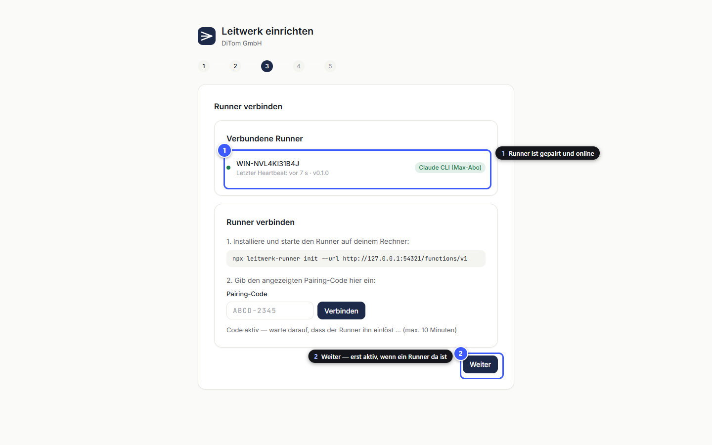
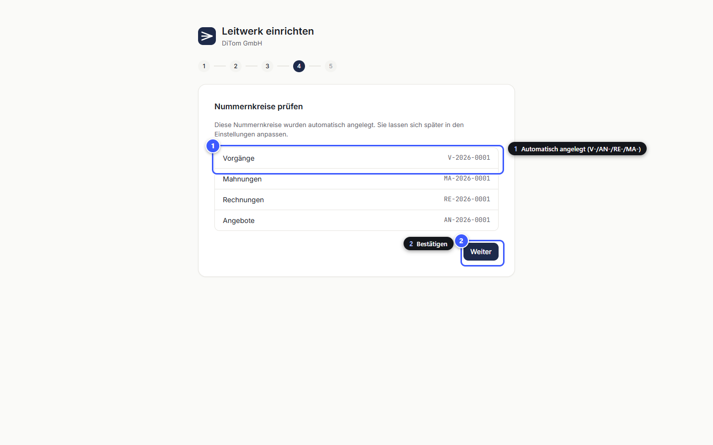
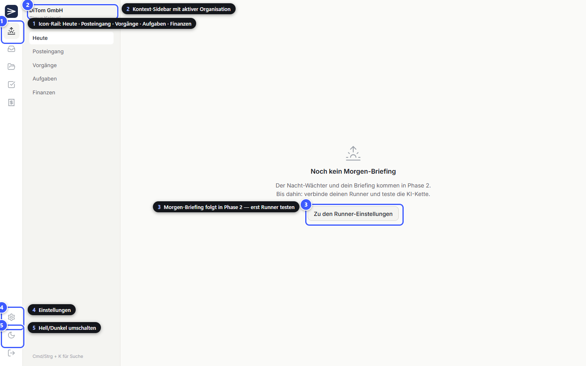
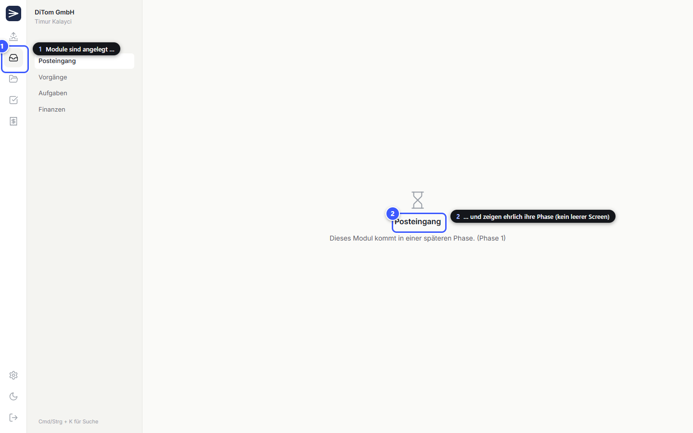
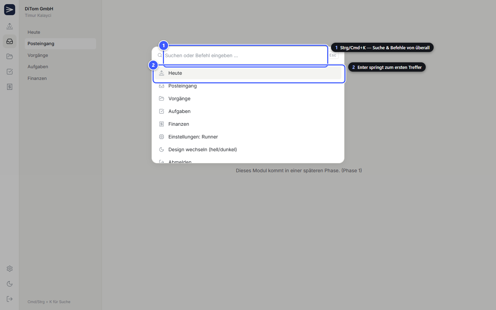
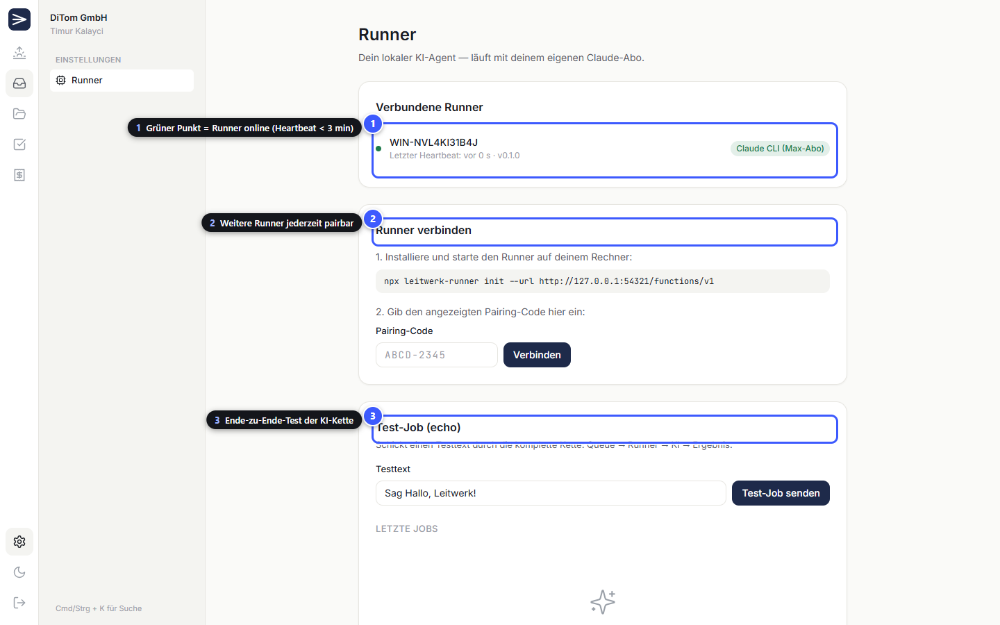
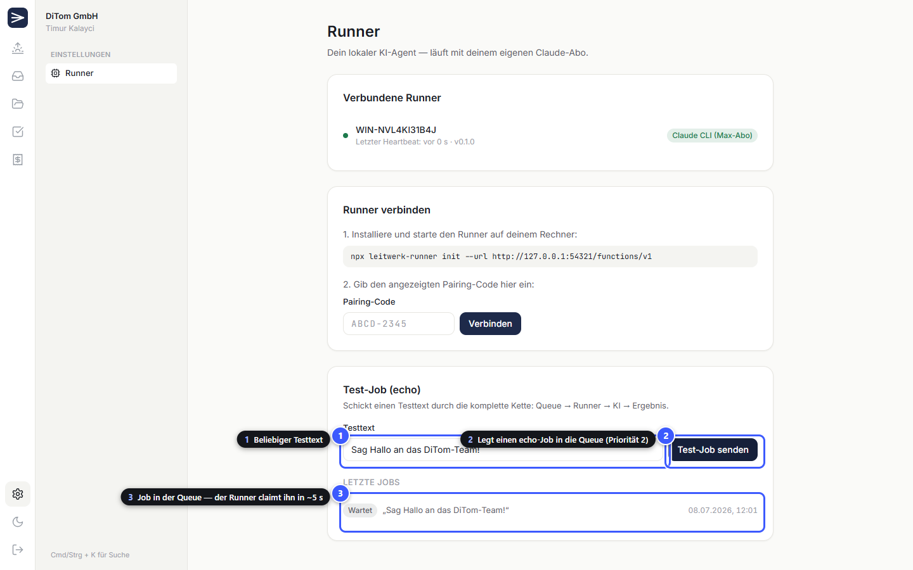
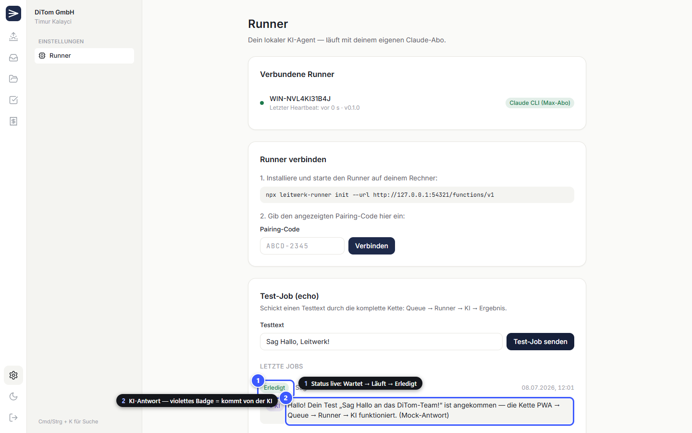
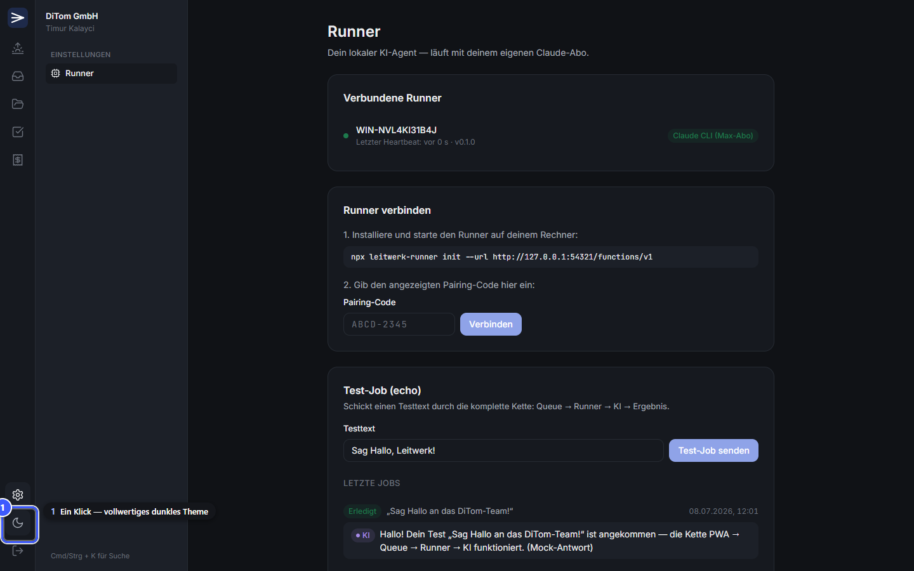

# Leitwerk Phase 0 — Test-Tutorial (lokal, ohne Supabase)

Dieses Tutorial zeigt **jedes Phase-0-Feature** mit annotierten Screenshots — aufgenommen
gegen die **lokale Mock-Umgebung**, die komplett ohne Supabase/Docker läuft. Alle
Screenshots stammen aus einem automatisierten Ende-zu-Ende-Lauf
(`tools/e2e-tutorial/run.mjs`) und lassen sich jederzeit reproduzieren.

> ⚠️ Die Mock-Umgebung ist **nur zum Testen/Demonstrieren**. Produktion läuft
> ausschließlich auf Supabase (siehe `CLAUDE.md` und `docs/CHANGELOG.md`).

---

## Die Test-Umgebung starten

Drei Bausteine ersetzen Supabase + echte KI:

| Baustein | Ersetzt | Start |
|---|---|---|
| `tools/mock-server/server.mjs` | Supabase (Auth, Datenbank, Edge Functions) auf Port 54321 | `node tools/mock-server/server.mjs` |
| `tools/mock-server/claude-mock.cjs` | Claude CLI (deterministische KI-Antwort) | wird vom Runner aufgerufen |
| `apps/pwa/.env` | Supabase-Zugangsdaten | siehe unten |

```bash
# 0. Einmalig: Abhängigkeiten + Runner bauen
pnpm install
pnpm --filter leitwerk-runner build

# 1. apps/pwa/.env anlegen (Mock-Werte, keine Secrets):
#    VITE_SUPABASE_URL=http://127.0.0.1:54321
#    VITE_SUPABASE_ANON_KEY=mock-anon-key

# 2. Mock-Backend starten (Terminal 1)
node tools/mock-server/server.mjs

# 3. PWA starten (Terminal 2)  →  http://localhost:5173
pnpm --filter @leitwerk/pwa dev

# 4. Runner pairen & starten (Terminal 3) — Code kommt aus Schritt 6 unten
node apps/runner/dist/index.js init --url http://127.0.0.1:54321/functions/v1
LEITWERK_CLAUDE_BIN="node tools/mock-server/claude-mock.cjs" node apps/runner/dist/index.js start
```

Screenshots neu erzeugen: `node tools/e2e-tutorial/run.mjs`
(Mock-Backend + PWA müssen laufen; vorher `tools/mock-server/data/` löschen für einen frischen Stand).

**Hinweise zur Mock-Umgebung:**
- Realtime (WebSocket) gibt es im Mock nicht — die PWA aktualisiert per Polling
  (Runner alle 30 s, Jobs alle 15 s) und beim Fenster-Fokus. In Produktion mit
  Supabase kommen Updates live per Realtime.
- Die Daten liegen in `tools/mock-server/data/db.json` — Datei löschen = frischer Stand.
- Die Mock-KI antwortet deterministisch; mit echter Claude CLI (`claude login`)
  einfach `LEITWERK_CLAUDE_BIN` weglassen.

---

## 1 · Anmelden


Der Einstiegspunkt der PWA. **(1)** E-Mail und **(2)** Passwort für bestehende Konten,
**(3)** meldet an. **(4)** Google-Login ist vorbereitet (aktiv, sobald der Betreiber die
OAuth-App nach `tutorials/02_google_oauth.md` registriert hat). Neue Nutzer gehen über
**(5)** zur Registrierung. Fehleingaben zeigen eine deutsche Fehlermeldung unter dem Formular.

## 2 · Konto erstellen


**(1)** Anzeigename (landet als `display_name` im Profil), **(2)** E-Mail als Login,
**(3)** Passwort mit Mindestlänge. **(4)** legt das Konto an — dabei entsteht automatisch
das Profil (Trigger aus Migration 001) — und startet direkt das Onboarding.

## 3 · Organisation anlegen


Leitwerk ist multi-tenant: Alles (Mails, Vorgänge, Rechnungen, Jobs) gehört genau einer
Organisation. **(1)** Name eingeben, **(2)** anlegen. Im Hintergrund passiert viel
(Migrationen 010 + 016): Der Ersteller wird **Owner**, Firmen-Stammdaten, vier
Nummernkreise und sieben Standard-Automationen (alle auf Autonomie-Stufe 1) werden angelegt.

## 4 · Onboarding Schritt 1: Firmen-Stammdaten


**(1)** Der Fortschrittsbalken zeigt die 5 Schritte; erledigte Schritte sind klickbar.
**(2)** Der Firmenname ist aus dem Org-Namen vorausgefüllt. **(3)** Bankdaten braucht
Phase 3 für Rechnungen (ZUGFeRD/XRechnung). **(4)** speichert alles nach `org_profile`
und setzt das Onboarding-Flag `company_done`.

## 5 · Onboarding Schritt 2: Postfach (Platzhalter)


**(1)** Die Gmail-Anbindung ist Phase 1 (E-Mail-Hub) — der Button ist bewusst deaktiviert
statt versteckt, damit klar ist, was kommt. **(2)** überspringt den Schritt.

## 6 · Onboarding Schritt 3: Runner verbinden (Pairing)


Das Herzstück des BYO-KI-Modells: **(1)** Der Nutzer startet den Runner auf seinem
Rechner — der Runner zeigt im Terminal einen 8-stelligen Pairing-Code an und pollt den
Broker. **(2)** Den Code in der PWA eintippen, **(3)** verbinden. Die PWA legt den Code
in `runner_pairing_codes` ab (10 Minuten gültig); beim nächsten Poll löst der Runner ihn
ein und erhält sein **Runner-Token** (nur als Hash in der DB — der Klartext existiert
genau einmal in dieser Antwort).

## 7 · Runner verbunden



**(1)** Der Runner erscheint mit Hostname, Heartbeat und Provider-Badge
(„Claude CLI (Max-Abo)“). Das Onboarding-Flag `runner_paired` wird automatisch gesetzt.
**(2)** „Weiter“ ist erst aktiv, wenn mindestens ein Runner verbunden ist —
überspringen geht trotzdem.

## 8 · Onboarding Schritt 4: Nummernkreise



**(1)** Die vier automatisch angelegten Nummernkreise mit Vorschau der nächsten Nummer:
Vorgänge (`V-2026-0001`), Angebote (`AN-`), Rechnungen (`RE-`), Mahnungen (`MA-`).
**(2)** bestätigt — anpassen lassen sie sich später in den Einstellungen (Phase 3).

## 9 · Onboarding abgeschlossen


**(1)** führt in die App-Shell. Das Onboarding merkt sich seinen Stand pro Flag —
wer es unterbricht, landet beim nächsten Besuch am ersten offenen Schritt.

## 10 · App-Shell: „Heute“



Das Layout nach `docs/DESIGN.md`: **(1)** Icon-Rail (56 px) mit den fünf Hauptmodulen,
**(2)** Kontext-Sidebar mit aktiver Organisation und Nutzer. **(3)** „Heute“ wird ab
Phase 2 das Morgen-Briefing — bis dahin führt der Empty-State ehrlich zum nächsten
sinnvollen Schritt. **(4)** Einstellungen und **(5)** Theme-Umschalter unten in der Rail.

## 11 · Modul-Platzhalter



**(1)** Alle Module sind navigierbar, **(2)** zeigen aber statt leerer Flächen einen
Empty-State mit ihrer Phase (Posteingang/Vorgänge → Phase 1, Aufgaben → Phase 2,
Finanzen → Phase 3). Kein Feature ohne Empty-State — Regel 9 aus `CLAUDE.md`.

## 12 · CommandBar (Strg/Cmd + K)



**(1)** Von überall per Strg/Cmd+K: Navigation und Befehle (Theme wechseln, Abmelden),
gefiltert beim Tippen. **(2)** Enter springt zum ersten Treffer, Esc schließt.
In Phase 4 wird daraus die globale Suche (Volltext + semantisch).

## 13 · Einstellungen → Runner



Die Kommandozentrale für den KI-Agenten: **(1)** Verbundene Runner mit Live-Status —
grüner Punkt bedeutet Heartbeat jünger als 3 Minuten (dieselbe Schwelle nutzt der
Watchdog serverseitig). **(2)** Weitere Runner (Zweitrechner, VPS) jederzeit pairbar.
**(3)** Der Test-Job prüft die komplette KI-Kette. Ist kein Runner online, erscheint
oben ein Hinweis-Banner — der Rest der App bleibt voll benutzbar.

## 14 · Test-Job senden



**(1)** Beliebigen Testtext eingeben, **(2)** senden — das legt einen `echo`-Job mit
Priorität 2 (interaktiv) in die Queue. **(3)** Der Job erscheint sofort als „Wartet“.
Der Runner pollt alle 5 Sekunden, claimt den Job (Prioritäts-Sortierung, ein Versuch
von maximal 3) und holt sich den Kontext von der Edge Function `build-job-context`.

## 15 · KI-Antwort



**(1)** Der Status läuft live durch: Wartet → Läuft → **Erledigt**. **(2)** Die Antwort
der KI — das violette **KI-Badge** markiert überall in Leitwerk, was von der Maschine
kommt (eiserne Design-Regel: Violett gibt es nur dafür). Der Runner hat den Prompt aus
dem Kontext gebaut, die (Mock-)KI ausgeführt, die Antwort strikt mit Zod geparst und
das Ergebnis mit Idempotenz-Hash über den Broker abgeliefert. Schlägt das Parsen fehl,
gibt es genau einen Reparatur-Versuch; danach greift der Backoff-Retry der Queue.

## 16 · Dark Mode



**(1)** Ein Klick auf den Mond in der Icon-Rail schaltet das vollwertige dunkle Theme um
(alle Design-Tokens aus `DESIGN.md`, inklusive angepasster Marken- und KI-Farben).
Die Wahl wird gespeichert; ohne Wahl gilt die Systemeinstellung.

---

## Was hier Ende-zu-Ende bewiesen ist (Definition of Done P0)

1. Registrierung → Org-Anlage → Onboarding-Wizard mit Stammdaten aus `org_profile` ✓
2. Runner-Pairing über Pairing-Code + Token-Hash ✓
3. Dummy-Job `echo` läuft komplett durch: PWA → Queue → Runner → KI → Ergebnis in der PWA ✓
4. Alle Views mit Loading-, Empty-, Fehler- und Offline-Zuständen ✓

Gegen echtes Supabase ist der Ablauf identisch — nur dass `supabase start` die
Datenbank stellt, die Edge Functions in Deno laufen und Updates per Realtime statt
Polling ankommen (siehe README „Dev-Quickstart“).
